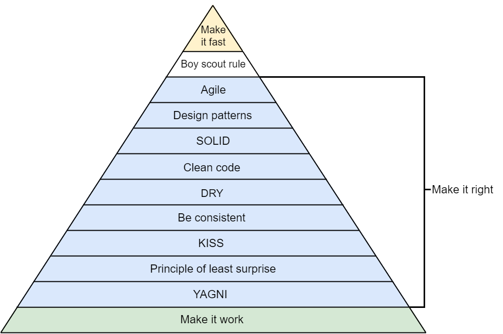

# Reguły wytwarzania oprogramowania i inne skrótowce

## Najważniejsze zasady, którymi trzeba się kierować

Bardzo dobry artykuł o tym [link](https://medium.com/@bartoszkrajka/principle-of-software-development-principles-f0143d6f405)

## Narzędzia dla architektury

Warto najpierw przechytać te artykuły:

[Software architecture diagrams - which tool should we use? ](https://dev.to/simonbrown/software-architecture-diagrams-which-tool-should-we-use-29e)  
[Visio, draw.io, LucidChart, Gliffy, etc - not recommended for software architecture diagrams](https://dev.to/simonbrown/visio-draw-io-lucidchart-gliffy-etc-not-recommended-for-software-architecture-diagrams-4bmm)

Do modelowania architektury można używać różnych typów narzędzi.

Tekstowych, które opisują diagramy, które możemy potem wygenerować:

- [mermaid](https://mermaid.js.org/)
- PlantUML
- Structurizr DSL - opisujemy strukturę raz a potem możemy wygenerować wiele typów diagramów dla niej [przykład](https://c4model.com/#ContainerDiagram)

Graficznych, gdzie ręcznie ustawiamy bloczki

- draw.io/ diagrams.net
- visio
- Gliffy
- [ExcaliDraw](https://excalidraw.com/)