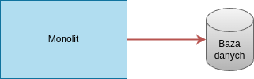
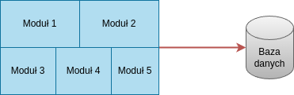
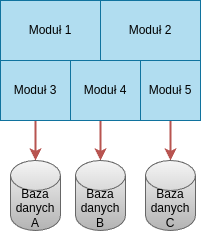

# Style Architektoniczne

## Monolit

Domyślnie stosowaną architekturą w większości wypadków jest architektura monolityczna. W pewnym uproszczeniu system monolityczny jest aplikacją, której kod źródłowy stanowi jedną, spójną bazę kodu. Może on składać się z wielu różnych modułów i elementów, ale sam w sobie stanowi zwięzłą całość. 
W zależności od stopnia integracji oraz sposobów wdrożenia można wydzielić kilka odmian aplikacji monolitycznych

**Monolit jednoprocesowy** - jest to najprostszy możliwy przykład, często traktowany jako domyślne podejście. Jest to system, który w całości jest wdrożony w ramach jednego procesu. Jest to w uproszczeniu system, który działa operując na informacjach znajdujących się w jakiejś bazie danych. Taki monolit nadal może być rozproszony, ponieważ dopuszczalne jest istnienie wielu instancji danego procesu. Jest to podejście pozwalające zapewnić większą niezawodność oraz pewną dozę skalowalności, ale powyżej pewnego progu wyzwaniem może okazać się szybki dostęp do wspólnej bazy danych. Takie wdrożenie często jest dobrym podejściem. David Heinemeier Hansson, twórca Ruby on Rails stwierdził, że taka architektura jest zalecana zwłaszcza w przypadku mniejszych systemów.

Przy odpowiednim zaprojektowaniu może się ona skalować wraz ze wzrostem potrzeb do momentu, gdy przekształci się ona w **Monolit modułowy**. Jest to odmiana monolitu jednoprocesowego, w którym w ramach procesu można wydzielić poszczególne moduły. Są to elementy o tyle odseparowane, że możliwa jest niezależna praca nad poszczególnymi z nich. Jednak nadal są one na tyle ściśle zintegrowane, że niezbędne jest ich wspólne wdrożenie. Całość kodu nadal wykorzystuje jedną wspólną bazę danych tak jak to widać na Rysunku poniżej. Dekompozycja kodu wpływa na sam proces tworzenia oprogramowania, nie zmienia ona jednak znacząco skalowalności, czy też wydajności rozwiązania.

Zdarza się, że w celu dodatkowego poprawienia skalowalności dokonuje się także dekompozycji samej bazy danych (podział np. na relacyjną, bazę z logami, object storage etc.).

Zalety

- Prostota - łatwo i szybko się pisze
- Łatwe pisanie testów
- Łatwe debugowanie i profilowanie kodu - możliwe szybkie prześledzenie pełnej ścieżki wykonania
- Cały kod znajduje się w jednym repoozytorium - co bardzo ułatwia nawigowanie

Wady:

- Powyżej pewnego progu wzrostu tak duży codebase zaczyna być problematyczny - chodzi tutaj nie tyle o skalowanie, co co rozmiar i złożoność codebase'u
- Mocne powiązanie kodu - ciężko jest napisać część wymagającą szybkich obliczeń w C++, zaś cześć bazodanową w Pythonie
- W wypadku zbyt dużych aplikacji ciężko jest się "wgryźć" w projekt
- Z czasem wprowadzanie zmian może być coraz bardziej pracochłonne i uciążliwe

W dobie wzrostu popularności mikroserwisów, chmur i usług serverless zasadność jego wykorzystania jest często podważana. Jednak mimo krytyki warto pamiętać, że decyzje architektoniczne powinny być podyktowane wymaganiami, a nie chwilową modą i trendami w branży.

Źródła:

- [Deconstructing the Monolith: Designing Software that Maximizes Developer Productivity](https://shopify.engineering/deconstructing-monolith-designing-software-maximizes-developer-productivity#)
- [The Majestic Monolith](https://signalvnoise.com/svn3/the-majestic-monolith/) - David Heinemeier Hansson, twórca Ruby on Rails o monolicie

## Mikroserwisy

Architektura mikrousługowa zwana także mikroserwisową jest rodzajem architektury, w której system składa się z niewielkich, niezależnych od siebie serwisów zwanych mikrousługami. Każdy z nich pełni jedną, ściśle określoną rolę taką jak zarządzanie użytkownikami, konwersja danych, wykonywanie obliczeń etc. Serwisy te można traktować jako niewielkie bloki, z których składa się cały system. Cała wymiana informacji pomiędzy blokami następuje za pomocą sieci, najczęściej wykorzystuje się do tego API wykorzystujące protokół REST. Dzięki ściśle określonym sposobom interakcji opisującymi, jakie dane powinny być odbierane i jakie wysyłane możemy pozwolić sobie na traktowanie poszczególnych mikrousług jako czarnych skrzynek, które możemy poprosić o wykonanie jakiejś czynności bez wnikania w to, jak jest ona zaimplementowana.

Dzięki takiemu podejściu deweloperzy pracujący nad takim rozwiązaniem mogą pracować z bazą kodu obejmującą tylko jedną usługę nie musząc się martwić jak to wpłynie na resztę systemu (o ile nadal przestrzega się ustalonych interfejsów). Duża autonomia poszczególnych serwisów pozwala także na elastyczne skalowanie tylko tych usług, które najbardziej tego wymagają. Jest to przydatne zwłaszcza w wypadku, gdy ze względu na specyfikę niektórych usług wymagają one różnych zasobów dyskowych, bądź obliczeniowych.  Dobrym przykładem są tutaj wszelkie systemy wykorzystujące przetwarzanie obrazu, uczenie maszynowe, czy też inne operacje wymagające GPU, jest to dość specyficzne wymaganie dla domeny maszyn serwerowych i wymaga innej klasy maszyn.

Zalety:

- Możliwość łatwego stworzenia systemu opartego na różnych technologiach
- Prace nad danym modułem nie wymagają poznania budowy całego systemu
- Ograniczenie wąskich gardeł oraz liczby SPoF (Single Point of Failure) - część systemu może nadal działać pomimo awarii części modułów

Wady:

- Dużo bardziej czasochłonna implementacja
- Problematyczny deployment
- Utrudnione debugowanie oraz zbieranie logów
- Kod mikroserwisów często wymaga wielokrotnej implementacji tych samych interfejsów komunikacyjnych, walidacji danych etc.

Źródła:

- Artykuł [A Comparative Review of Microservices and Monolithic Architectures](https://ieeexplore.ieee.org/document/8928192)
- [The Journey from Monolith to Microservices to Edge](https://web.archive.org/web/20231003203939/https://www.section.io/blog/monolith-microservices-edge-computing//)