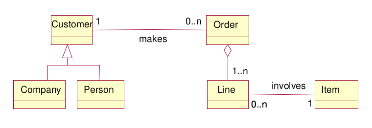
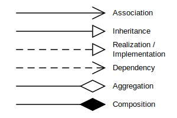
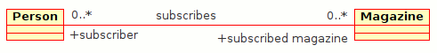
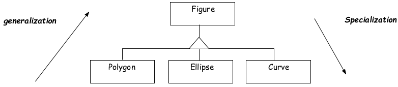
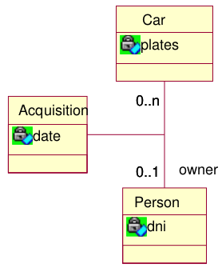
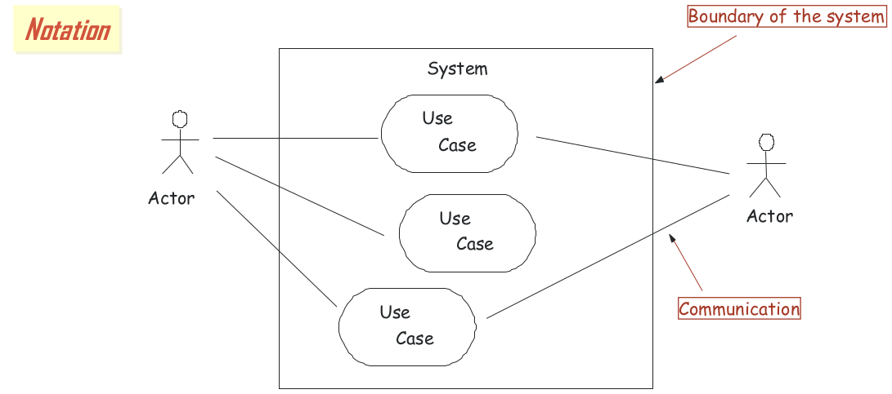
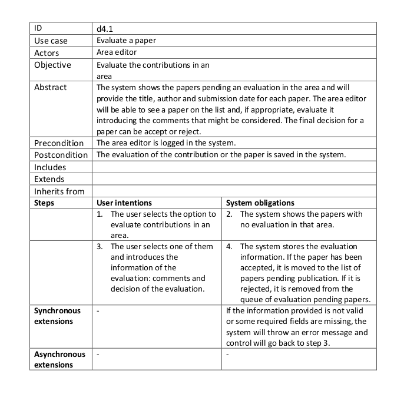
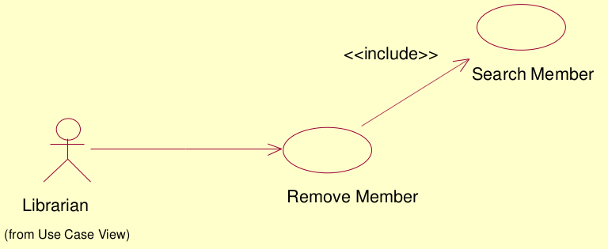
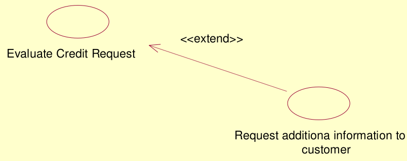
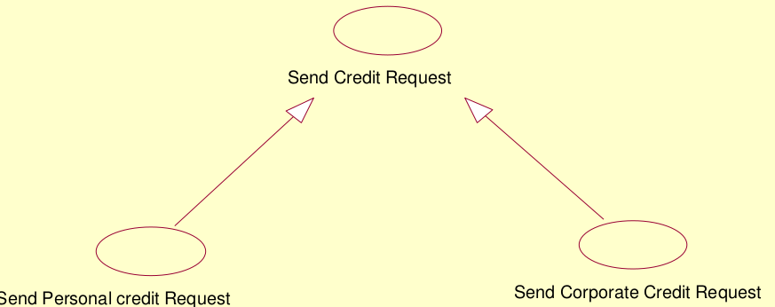

# UML - Unified Modelling Language

Jest to uniwersalny język do modelowania systemów i nie tylko.

Istnieje wiele typów diagramów UML. Takie jak:

- Diagram klas - pozwala na łatwe opisanie systemów obiektowych
- Diagram komponentów - pokazuje fizyczne elementy systemu oraz interakcje między nimi
- Diagram stanów - opisuje stany obiektu i przejścia między nimi
- Diagram aktywności (czynności) - podobny do diagramu stanów, z tą różnicą, że opisuje wiele obiektów
- Diagram przypadków użycia (use case) - pokazuje aktorów oraz przypadki użycia systemu
- ...

## Diagram klas

Przedstawienie klas oraz zależności i relacji między nimi. [Wikipedia](https://pl.wikipedia.org/wiki/Diagram_klas)

Poszczególne klasy mają wyróżnioną nazwę oraz atrybuty takie jak:

- metody (funkcje)
- właściwości
- pola (zmienne)

Możemy je pokazwać jako sama nazwa, opcjonalnie wzbogacona o typ, argumenty i inne cechy. Dozwolone są tylko typy bazowe (`integer`, `real`, `char`, `string`, etc.) bez klas.

Ogólnny schemat:

`[visibility] Name [: Type] [=initial value]`

Możemy także określać widoczność atrybutów

- `+` dla public – publiczny, dostęp globalny
- `#` dla protected – chroniony, dostęp dla pochodnych klasy (wynikających z generalizacji)
- `−` dla private – prywatny, dostępny tylko w obrębie klasy (przy atrybucie statycznym) lub obiektu (przy atrybucie zwykłym)
- `~` dla package – pakiet, dostępny w obrębie danego pakietu, projektu.

### Zależności pomiędzy klasami

Zależności pomiędzy poszczególnymi klasami opisujemy za pomocą związków (powiązań)

- **Zależność** (ang. dependency) – najsłabszy związek znaczeniowy między klasami, gdy jedna z klas używa innej. Na diagramie klas oznaczana `------->` przerywaną linią zakończoną strzałką wskazującą kierunek zależności
- **Asocjacja** (ang. association) wskazuje na silniejsze powiązanie pomiędzy obiektami danych klas (np. firma zatrudnia pracowników). Na diagramie asocjację oznacza się za pomocą linii. Nazwy cech (np. zatrudniony, zatrudniający) wraz z krotnością umieszcza się w punkcie docelowym asocjacji. Nazwę asocjacji podaje się pośrodku (np. zatrudnia).  
  
- **Generalizacja** lub **dziedziczenie** - wypełniona strzałka wskazuje na klasę bazową względem pochodnej
  
- **Agregacja** (ang. aggregation) reprezentuje związek typu całość-część, czyli jakaś większa całość jest rozbita na elementy. Oznacza to, że elementy częściowe mogą należeć do większej całości, jednak również mogą istnieć bez niej (np. koła i samochód).
- **Kompozycja** (ang. composition), jest silniejszą formą agregacji. W związku kompozycji, części należą tylko do jednej całości, a ich okres życia jest wspólny — razem z całością niszczone są również części. W dużej mierze jest to kwestia umowna, zależna od danego systemu.  
  

W wypadku asocjacji możemy także określić krotność zależności

- `0` brak instancji (rzadkie)
- `0..1` Zero albo jedna
- `1` ,`1..1` dokładnie jedna
- `0..*`, `*` Zero albo więcej instancji
- `1..*` Jedna, albo więcej

Niektóre asocjacje same w sobie mogą być reprezentowane poprzez klasy. Np w wypadkach, gdy musza przechowywać więcej własnych danych.  
Są to **klasy asocjacyjne** (`Link classes`)

// TODO UML, a obiekty (wykład 05 i 04 z LTP na UPV) oraz przykładowe analizy

## Diagram przypadków użycia (Use case)

[Wikipedia](https://pl.wikipedia.org/wiki/Diagram_przypadk%C3%B3w_u%C5%BCycia)

Jest on wykorzystywany do opisywania w jaki sposób powinien działać nasz system i jakie powinien posiadać funkcjonalności. Jest on bardzo pomocny przy definiowaniu wymagań funkcjonalnych.

Wyróżniamy na nich:

- aktorów - opisujące uczestników systemu oraz ich role. Aktorem osobowym może być osoba, zespół, dział, instytucja, organizacja, zrzeszenie organizacji lub organizacja wirtualna. Nazwy aktorów osobowych często pokryte są z nazwami funkcji jakie pełnią w organizacji, projekcie lub przedsięwzięciu bądź nazwą stanowiska jakie piastują. Natomiast aktorem bezosobowym może być system zewnętrzny (podsystemy, bazy danych), urządzenie lub czas (UWAGA Sam system nigdy nie jest aktorem)
- przypadki użycia - opisują ciągi akcji i ich warianty. Na ogół jeden przypadek użycia opisuje jedną funkcjonalność.
- związki - opisują relacje pomiędzy elementami

//TODO opisać dokładniej relację między aktorami a przypadkami, np dlaczego kupujący i przedający mogą się łączyć z jendym przypadkiem o nazwi sprzedaj książkę.

### Przypadki użycia

Poszczególne przypadki użycia częśto opisuje się także za pomocą tabelek.

| Use Case       |        |
| -------------- | ------ |
| Actors         |        |
| Summary        |        |
| Preconditions  |        |
| Postconditions |        |
| Includes       |        |
| Extends        |        |
| Inherits from  |        |
| Flow of events |        |
| Actor          | System |
|                |        |

??? Przykładowa wypełniona tabelka

Poszczególne przypadki użycia mogą wchodzić w związki nie tylko z aktorami, lecz także z innymi przypadkami użycia.

Relacja **include** - przypadek A zawiera przypadek B, kiedy każde wykonanie A wymaga, abyśmy wykonali także B.

Aby kogoś usunąć z bazy danych musimy go najpierw wyszukać.

Relacja **extend** - przypadek B rozszerza przypadek A, kiedy podczas wykonywania A w pewnych przypadkach możemy (ale nie musimy) wykonać B.

Możemy mieć także typową relację dziedziczenia. (podobnie jak u aktorów)

### Opracowywanie diagramu

Podczas prac nad diagramem możemy przyjąć dwa sposoby podejścia do tematu. 

- **Top Down**, czyli `Szukamy aktorów` -> `Szukamy przypadków` -> `Uszczegółaiwamy`
- **Bottom up** `Tworzymy scenariusze` -> `Generalizujemy` -> `Organizujemy wszystko w diagram`

Podczas prac nad diagramem warto rozwazyć kto, dlaczego i jak będzie używać naszego systemu. Pomoże nam to znaleźć aktorów.

Każda grupa lub osoba może być znaleziona jednej z poniższych kategorii:

- Kto będzie używał systemu?
- Kto będzie instalował system?
- Kto będzie utrzymywał system?
- Kto wyłączy system?
- Jakie inne systemy będą się z nim komunikować?
- Kto otrzymuje informacje?
- Kto dostarcza informacji?

Jak już znajdziemy naszych aktorów warto się zastanowić nad ich przypadkami użycia. Warto tutaj zwrócić uwagę na pytania takie jak:

- Jakie zadania wymagane są od aktorów z systemu?
- Czy aktor będzie mógł tworzyć, przechowywać, zmieniać lub usuwać informacje z systemu?
- Czy aktor będzie informował system o zmianach zachodzących na zewnątrz?
- Czy każdy aktor będzie informowany o zmianach stanu systemu?

## Diagram aktywności

//TODO

## Diagram stanów

//TODO
