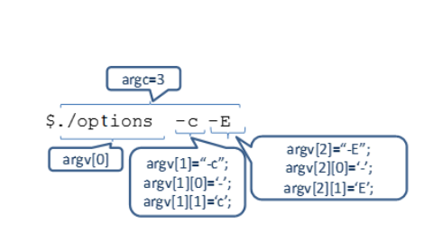

# ANSIC C

## Kompilacja

Najpopularniejszym kompilatorem jest gcc

```bash
gcc [-options] [source_files] [object_files] -o output_file
```

Podstawowe flagi

| Flaga     | Opis                                                                                                                                               |
| --------- | -------------------------------------------------------------------------------------------------------------------------------------------------- |
| -c        | Preprocessing, compilation, assembly producing a binary object file (.o)                                                                           |
| -S        | Preprocessing and compilation producing an assembly language file                                                                                  |
| -E        | Preprocessing only sending the output to the standard output (terminal)                                                                            |
| -o plik   | nazwa pliku wyjściowego                                                                                                                            |
| -Isciezka | Ścieżka dla plików nagłówkowych (bez spacji, np `-I/usr/lib`)                                                                                      |
| -lNAZWA   | Biblioteka do której mamy linkować program, mówimy kompilatorowi do jakich bibliotek linkujemy program, np `-lm` linkuje do biblioteki lib**m**.so |
| -v        | Verbose gcc opisuje kroki kompilacji                                                                                                               |

Na ogół po prostu kompilujesz w jednej fazie

```bash
gcc -o executable programik.c
```

## Zmienne

| Nazwa  | Rozmiar | Czym jest                                                                                 |
| ------ | ------- | ----------------------------------------------------------------------------------------- |
| int    | 32b     | Liczba całkowita                                                                          |
| float  | 32b     | Liczba zmiennoprzecinkowa                                                                 |
| double | 64b     | Dokładniejszy float                                                                       |
| char   | 1B      | =8b Jednobajtowe liczby całkowite 0-255, używane także (głównie) do przechowywania znaków |
| bool   |         | 1(true) lub 0(false) logika (wymaga `stdbool.h`)                                          |
| void   | -       | Typ pusty                                                                                 |

int

Sposoby zapisu liczb:

- zwykły: 2, 456, 42 itp.
- ósemkowy 010 (8) 015 (13) 0100 (64)
- szesnastkowy 0x12 (18) 0xF (15)

float

Sposoby zapisu liczb:

- zwykły: 2.43, 456, 3.14 itp.
- naukowy(wykładniczy) 6e10 (6\*1010) 1.5e2 (150)

char

Zapis:

- zwykły: char letter1 = 'a';
- jako kod ASCII: char letter2=97; 97 to a w kodzie ASCII
  \*putchar(char)-wypisuje char/tablice charów a po niej daje enter

### Specyfikatory

signed -liczba będzie także mogła być ujemna
unsigned -liczba będzie nieujemna
Short i long są wskazówkami dla kompilatora, by zarezerwował dla
danego typu mniej/więcej pamięci

np.:

```c
signed char a; /*zmienna a przyjmuje wartości od -128 do 127*/
unsigned char b; /*zmienna b przyjmuje wartości od 0 do 255*/
signed int i = 0; // to samo co: int i = 0;
```

### Wskaźniki-zmienne przechowujące adres zmiennej

```c
int *px;//tworzymy zmienną przechowującą wskaźnik prowadzący do
int-a;
int x=7;
&x //zwraca adres zmiennej
*px;//weź wartość znajdującą się pod danym adresem
```

Wskaźniki i const

```c
int j = 3 ;
int ∗ const pj2 = &j ;
++(∗pj2 ) ;//tylko to się da
int j = 3 ;
const int ∗ const pj3 = &j ;
//++pj3 ; // nie da sie − const
//++(∗pj3 ) ; // nie da sie − const
//pj3 = &i ; // nie da sie − const
printf( " const : %d\n " , ∗ pj3 )
```

### Tablice i alokowanie pamięci

Definiowanie tablic

```c
    int tab[2];
    tab[0]=32; tab[1]=3;
```

```c
    int tab[]={32,3};
    int tab[2][3]={
    {2,3,5},
    {1,3,4}};////definiowanie tablicy
    int tab[2][3]={
    {4},
    {5}};/////reszta to zera
    int tab[2][2]={1,2,3,4};
    int tab[2][2]={1,2,3}; //reszta to zera
    int niePoKol [12]={1 ,2 , [5]=3 , 4 };//reszta to zera
```

lub dla tablic znaków

```c
    char slowo[]=”Ala”;
    //(od C99 mamy tablice VLA)
    int liczbaEl=4;
    int tablica[liczbaEl];
    int sum2dArr(int liWierszy ,int liKolumn , int vla
    [liWierszy][likolumn]) ;
```

**Tablica a wskaźnik** - w praktyce zmienna trzymająca tablicę jest wskaźnikiem na jej pierwszy element

```c
    char tab[]= " Ala ";
   //  Zmienna tab zawiera wskaźnik do
   //  pierwszego elementu tablicy
    printf(„%c”,tab+2)//wydrukuje a
```

#### Tablice dynamiczne+ Dynamiczna Alokacja pamięci

- `malloc`( rozmiar_w_bajtach ); – zwraca wskaźnik do zaalokowanego xobszaru lub NULL (gdy zbraknie pamięci albo innym błędzie). xPrzydzielona pamięć ma nieokreśloną zawartość
- `calloc`( ile_el, rozmiar_elementu ); – to samo co malloc, tyle, że xprzydzielona pamięć zainicjowana zerami
- `free`( wsk_zwrocony_przez_malloc_lub_calloc ); – zwalnia pamięć, xNULL może być jej argumentem

Przykładowa tablica

```c
  puts("Ile int-ów?" );
  int tabSize=0;
  scanf("%d",&tabSize);
  int *tab= malloc(tabSize∗sizeof(int));
  if(!tab){
   fputs("Brak pamieci\n" ,stderr);
   return 1;
  }
```

Dynamiczna tablica prostokątna -znamy szerokość przed deklaracją

```c
  int SZER=5;
  int wys=4;
  int (∗pTab) [SZER ] ;
  pTab =sprAlokPam (malloc(wys∗ sizeof ∗pTab));
```

Dynamiczna tablica prostokątna, nie znamy ani wysokości ani szerokości

```c
int szer=5;
int wys=4;
int ∗∗tabl=sprAlokPam(malloc(wys ∗ sizeof(int∗)));
for ( int j =0; j<wys;++ j )
   tabl[ j ]=sprAlokPam( malloc( szer ∗ sizeof(int)));
for(int j=0; j<wys;++j)///zwalnianie
   free(tabl[j]);
free(tabl);
```

Dynamiczna tablica prostokątna

```c
int szer=5;
int wys=4;
int ∗∗tabl=sprAlokPam(malloc(wys∗sizeof(int∗)));
for(int j=0;j<wys;++j)
   tabl [ j ]=sprAlokPam(malloc(szer∗sizeof(int)));
```

### Struktury

```c
struct struktura{
   int zmienna;
   bool prawda=true;//możemy je od razu definiować
   char literka;
   ///itp. tu mogą być tablice, zmienne, inne struktury
};
typedef struct {
   int p1, p2;
} Struktura;
int main ()
{
   Struktura s = { 0, 0 };
   Struktura \*wsk = &s;
   wsk->p1 = 2;
   wsk->p2 = 3;
   return 0;
}
```

\*W strukturach nie działają tablice VLA
\*\*typedef struct struktura st; pomaga skrócić zapis i od teraz
definiując strukturę zapisujemy tylko st

### Typ wyliczeniowy - Enum

Każdy element wyliczenia jest widziany jako stała
Z kolejnymi elementami skojarzono kolejne liczby typu int (licząc od 0)

```c
enum Miesiace{STY,LUT,MAR,KW,MAJ,CZER,LIP ,SIER
,WRZ,PAZ,LIST, GR};
```

Można przypisać konkretną wartość, pozostałe elementy to kolejne liczby

```c
enum Miesiace{STY=1 ,LUT,MAR,KW, MAJ,CZER,LIP ,SIER
,WRZ, PAZ, LIST,GR};
```

Każdemu elementowi można przypisać liczbę, dopuszczalne są nawet
powtórzenia

```c
enum ZnakiSpecj{DZWONEK=’\b’ ,TAB=’\t’ ,NOW_LINIA
=’\n’};
```


## Budowa programu

W każdym programie punktem początkowym jest funkcja `main`

Przyjmuje ona argumenty:

- `argc` - liczba argumentów przekazanych do programu
- `argv` - tablica ze stringami argumentów

A zwraca ona int-a będącego kodem wyjścia (0-sukces)

```c
#include <stdio.h>

int main(int argc, char* argv[])
{
   //program
}
```



## Biblioteka standardowa

### Pisanie/czytanie

Cla C standardową biblioteką jest `stdio.h`

```c
#include <stdio.h>

int main(){
   //printf(<control string> [, <arguments list> ] )

printf("\n Podaj liczbe: ");

//scanf( <control_string>, <arguments_list >)
int num;
scanf("%d", &num);
};
```

W kontrolnych ciągach znaków wykorzystujemy specyfikatory formatu z tabelki poniżej

**Tabelka z typami formatów**

| Format     | Description                                          | Supported data types                           |
| ---------- | ---------------------------------------------------- | ---------------------------------------------- |
| %c         | Character                                            | char,unsigned char                             |
| %d         | Signed Integer short ,unsigned short ,int ,long      |
| %e or %E   | Scientific notation of float values                  | float,double                                   |
| %f         | Floating point float                                 |
| %g or %G   | Similar as %e or %E                                  | Float, double                                  |
| %hi        | Signed Integer(Short)                                | short                                          |
| %hu        | Unsigned Integer(Short)                              | unsigned short                                 |
| %i         | Signed Integer                                       | short, unsigned short, int,long                |
| %l         | or %ld or %li Signed Integer                         | long                                           |
| %lf        | Floating point                                       | double                                         |
| %Lf        | Floating point                                       | long double                                    |
| %lu        | Unsigned integer                                     | unsigned int unsigned long                     |
| %lli, %lld | Signed Integer                                       | long long                                      |
| %llu       | Unsigned Integer                                     | unsigned long long                             |
| %o         | Octal representation of Integer.                     | short, unsigned short, int, unsigned int, long |
| %p         | Address of pointer to void \*, (wskaźnik)            | void \*                                        |
| %s         | String                                               | char \*                                        |
| %u         | Unsigned Integer                                     | unsigned int unsigned long                     |
| %x         | or %X Hexadecimal representation of Unsigned Integer | short, unsigned short, int, unsigned int, long |
| %n         | Prints nothing                                       |                                                |
| %%         | Prints % character                                   |                                                |

**Znaki specjalne**

| Znak | Znaczenie/akcja               |
| ---- | ----------------------------- |
| `\n` | Nowa linia (ASCII 010)        |
| `\t` | Tabulacja pozioma (ASCII 009) |
| `\v` | Tabulacja pionowa             |
| `\f` | Nowa strona                   |
| `\r` | Powrót kursora (ASCII 013)    |
| `\\` | Znak `\` (ASCII 092)          |
| `\"` | Znak `"` (ASCII 034)          |
