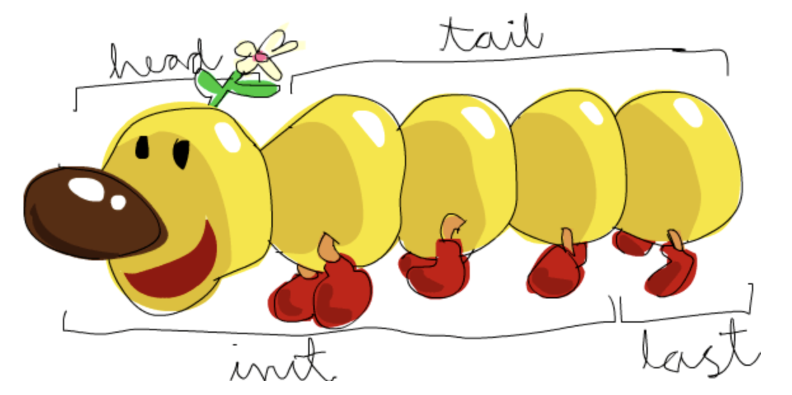

# Haskell λ

Jest to statycznie typowany, głównie deklaratywny, czysto funkcyjny język programowania.

Jego najpopularniejszym kompilatorem jest GHC (Glasgow Haskell Compiler).

Podczas programowania korzystamy z wyrażeń (opisujących coś) a nie z instrukcji (mówiących co ma być zrobione).

Jedną z najważniejszych właściwości tego języka jest to, że funkcje **zawsze** zwracają tą samą wartość dla tych samych argumentów wejściowych. (nie ma żadnych zmiennych globalnych, statycznych ani innych rzeczy, które mogłyby wpływać na wynik).

## Zmienne

Większość przydatnych rzeczy jest w [dokumentacji](https://hackage.haskell.org/package/base-4.9.1.0/docs/Prelude)

- `Char` - znak
  - `isAlpha`, `isAlphaNum`, `isDigit`, `isLower`, `isUpper` :: **Char -> Bool**
  - `toLower`, `toUpper` :: **Char -> Char**
  - `putChar` :: **Char -> IO ()**
- `String` - `type String = [Char]`
- `Num`, `Int`, `Float` - liczba
  - `div`, `mod`
- `()` krotka
  - `fst` - zwraca pierwszy element
  - `snd` - zwraca drugi element
- `Bool`
  - Operatory
- `[]` - lista (patrz Operacje na listach)

Do zdefiniowania zmiennej możemy użyć słowa kluczowego `let`

```hs
let x = 4 in x * x
```

**Int <-> Char** konwersja pomiędzy tymi typami jest możliwa

```hs
ord ‘b’
>98
chr 98
>‘b’
```

### Typy

Poza wbudowanymi typami zmiennych możemy definiować własne

**Synonymous types** - używają już istniejących typów używamy tu słowa kluczowego `type`

```hs
type Name = String
type Position = String
type Age = Int
type Course = Int

type Point = (Float, Float)
type Path = [Point]
```

**Algebraic types** - typy algebraiczne są typami złożonymi zdefiniowanymi przez użytkownika. Używamy tu słowa kluczowego `data`

```hs
data Person =   Student Age Name Course |
                Professor Name Position |
                Director Name

namePerson :: Person -> Name
namePerson (Student e n c) = n
namePerson (Professor n c) = n
namePerson (Director n) = n

stud1 = Student 21 "Marian" 12
```

Tutaj słowa Student, Professor, Director służą do określenia typu danej struktury. (data constructor symbols)

Wykorzystując same symbole konstruktorów możemy tworzyć enumy

```hs
data Day = Mon | Tue | Wed | Thu | Fri | Sat | Sun
```

**Functional types** - budują i opisują funkcje

```hs
type MyType = (Int -> Int)
fib :: MyType
```

Przykłady:

- `not` to wartość typu `Bool -> Bool`
- `(2 +)` ma typ `Int -> Int`
- `map` daje `(a -> b) -> [a] -> [b]` (przyjmuje funkcję robiązą z a b oraz tablicę a z potem zwraca tablicę b)

Operator **->** zwija się z prawej strony

Tzn `a -> b -> c` **jest równoznaczne** z `a -> (b -> c)`  
a nie `(a -> b) -> c`

Należy jednocześnie pamiętać, że funkcje zwijają się od prawej

`f a b` to ekwiwalent `(f a) b` a **nie** `f (a b)`  
Czyli  
`$ not not false` da nam error

## Operacje

Funkcje są wywoływane poprzez podanie ich nazwy oraz argumentów

```hs
sort [42,13,22]
> [13,22,42]:: (Num a, Ord a) => [a]
```

### Listy

#### Tworzenie i dodawanie

Aby dodać element do listy używamy `:`

```hs
'a' : []
> "a":: [Char]
```

Tutaj do pustej listy dodaliśmy literę `a` dzięki czemu dostaliśmy stringa.

Do tworzenia list możemy też używać automatycznego generowania

Przykłady:

- `[2..10]` is `[2,3,4,5,6,7,8,9,10]`
- `[1..]` is `[1,2,3,4,...`
- `[1,3..10]` is `[1,3,5,7,9]`
- `[’a’..’e’]` is `“abcde”`

Lub mechanizmu `List comprehension`

`[wyrażenie przyjmujące zmienne | generator, filtry, generator, filtry, ...]`

Na przykład

```hs
[ x*x | x<-[1..5], odd x ]
> [1, 9, 25]
```

**repeat** nieskończone listy

```hs
Prelude> repeat 3
[3,3,3,3,3...]
```

#### Operacje

**Pobieranie** - poniżej



**Inne** - operator `++`

```hs
-- Łączenie list
Prelude> [3,4]++[5]
[3,4,5]

-- Indeksowane elementy
Prelude> [45,43,12,54] !! 2
12

-- branie x elementów z listy
Prelude> take 3 (repeat 1)
[1,1,1]

-- usuwanie elementu z listy
Prelude>
```

#### Funkcje dla list

Funkcja `zip` łączy dwie listy w listę krotek

```hs
zip [1,2] ["a","b"]
> [ (1,"a"), (2,"b")]
```

```hs
> length [1,2,3]
3
```

`filter (a -> Bool) -> [a] -> [a]` - przefiltrowuje wybraną listę, otrzymujemy tylko elementy dla których nasza funkcja zwraca `True`

```hs
> filter even [1,2,4,5,32]
[2,4,32]
```

`map :: (a -> b) -> [a] -> [b]` - aplikuje wybraną funkcję na wszystkie elementy wybranej listy i zwraca listę wyników

```hs
> map square [9,3]
[81,9]
> map (<3) [1,2,3]
[True,True,False]
```

## Funkcje

FUnkcje są podstawotą częścią języka. Mogą być przekazywane jako argumenty, lub modyfikowane i częściowo aplikowane (partial application)

partial applications:

```hs
(+) :: Int -> Int -> Int
$ (2 +) 5
7
```

```hs
add_2 :: (Int -> Int)
add_2 = (2 +)
$ add_2 5
7
```

### Definiowanie

Funkcja składa się z opcjonalnego opisu typów  
`nazwaFun :: Typ -> Typ -> Typ...`  
Oraz samej definicji, tutaj mamy 2 warianty:

```hs
addRange :: Int -> Int -> Int
addRange x y
  | x == y = x
  | x < y = x + addRange (x + 1) y
  | otherwise = y + addRange (y + 1) x
```

oraz

```hs
numCbetw2 :: Char -> Char -> Int
numCbetw2 c1 c2 =
  let x = ord c2 - ord c1
   in if abs x == 0 then abs 0 else abs x - 1
```

TODO
Argumenty przekazywane do funkcji mogą mieć formę listy (łączonej strzałkami `->`) lub krotek `(el1,el2,...)`.

### Łączenie funkcji

Wykorzystując kropkę `.` możemy łączyć funkcje w ciągi

```hs
(sum . map square . filter even) [1 .. 10]
```

Powyższy kod zwróci nam sumę kwadratów liczb parzystych dla liczb z zakresu 1-10.
