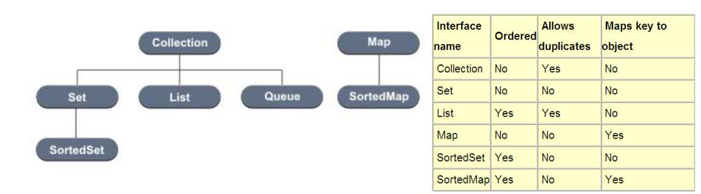
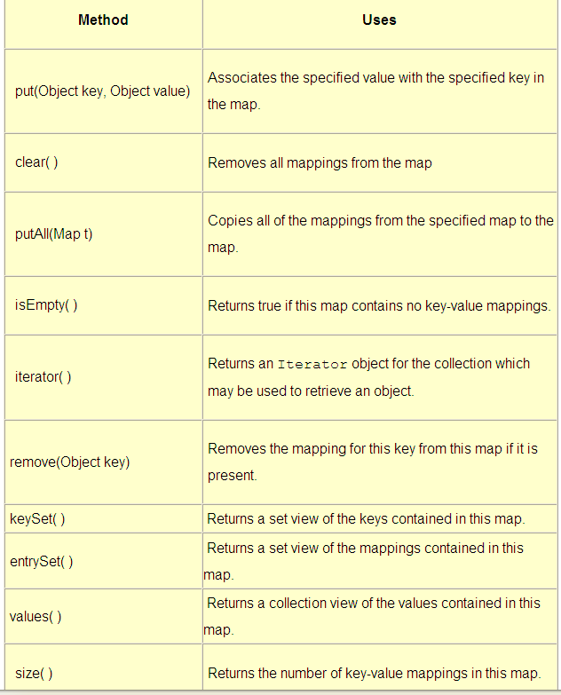
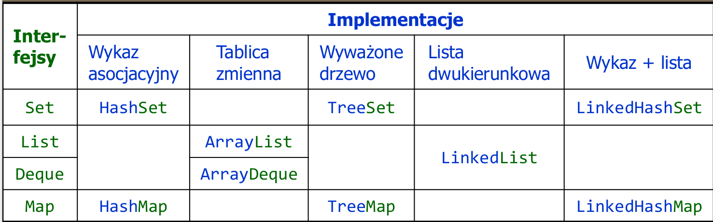
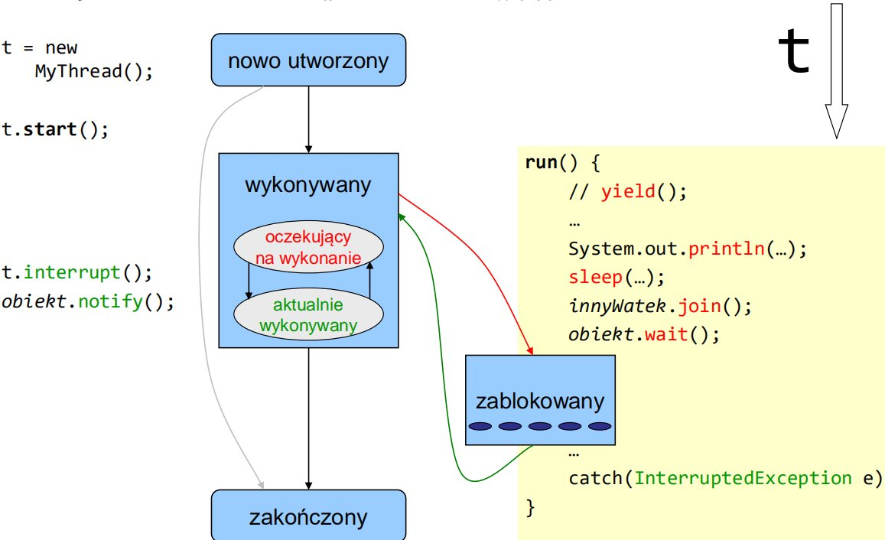
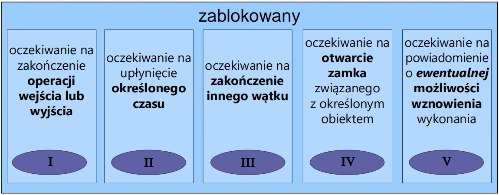

# Java Notatki

## Narzędzia

- `jshell` – interpretator interaktywny **?jak importować w nim własne pakiety?**
- `jlink` – generacja modułu aplikacji

### HelloWorld w javie

```java
public class HelloWorldApp {
    public static void main(String[] args) {
        System.out.println("Hello world from Java!");
    }
}
```

Wszystko jest tu klasą, nasza apka też. Jeżeli chcemy, aby jakaś klasa zaczęła coś robić przy jej samodzielnym uruchomieniu to dodajemy funkcję: `public static void main(String[] args)`

## Pakiety

W jednym pliku .java można zdefiniować wiele klas, ale tylko jedna z nich może bypubliczna i jej nazwa musi odpowiadać nazwie pliku.

Każda klasa należy do jakiegoś pakietu. Jeśli w pliku z kodem źródłowym klasy nie występuje na początku deklaracja przynależności tej klasy do konkretnego pakietu, wówczas klasa ta będzie należeć do domyślnego pakietu.
Klasy należące do tego samego pakietu mogą odwoływać się do siebie bez konieczności stosowania nazw kwalifikowanych (bez przedrostka)

Konwencja nazewnicza dla nazw pakietów: nazwa_firmy.nazwa_pakietu.

```java
import java.applet.Applet;
public class App extends Applet {////kod
}
//LUB
public class App extends java.applet.Applet {////kod
}
```

Klasa System jest zawarta w java.lang, importowanym automatycznie

## Typy danych

**Wbudowane** – określone przez twórców języka
– typy proste (albo: typy dla wartości, value-type): zmienne tych typów zawierają wartości tychże typów
– typy referencyjne: zmienne tych typów zawierają odniesienie do tablicy lub obiektu, który reprezentują
**Definiowane** przez programistę
– klasy
– typy wyliczeniowe (enumeration)

Java ma **statyczne typowanie** tzn, że raz zdefiniowana zmienna nie zmienia swojego typu (jak np. w pythonie)

Wbudowane typy proste

- całkowitoliczbowe, kodowane U2
  - `byte`   jednobajtowy
  - `short`  dwubajtowy
  - `int` czterobajtowy
  - `long` ośmiobajtowy
- zmiennoprzecinkowe, kodowane IEEE 754
  - `float` czterobajtowy
  - `double` ośmiobajtowy
- inne
  - `char` dwubajtowy, kodowany Unicode (utf-16)
  - `boolean` wartość logiczna true lub false

do javy 11 można stosować identyfikator typu wywnioskowanego:
`var s = "test";`

### Stałe

**Literały** – stałe bez nazwy, o typie wynikającym ze sposobu zapisu literału, np.

| 78, | 8864L, | 37.266, | 37.266D, | 37.266F, | ’c’, | true, null |
| --- | ------ | ------- | -------- | -------- | ---- | ---------- |
| int | long   | double  | double   | float    | char | boolean    |

oraz łańcuchy znaków, typu String: "ala ma kota"
**Stałe symboliczne** – stałe opatrzone nazwą i jawną deklaracją typu

```java
final typ NAZWA_STAŁEJ = wartość;
//np.
final float PI= 3.14;
```

Lokalną stałą symboliczną można zainicjować później – najpierw wystąpi sama
deklaracja, a później przypisanie pierwszej (i ostatecznej) wartości.

```java
final int STAŁA_CZYSTA; // Definicja stałej
/**/
STAŁA_CZYSTA = 0; // Inicjalizacja stałej
```

### Typ wyliczeniowy

```java
enum Season { WINTER, SPRING, SUMMER, FALL }
```

– kompilator sprawdza zgodność typu
– może być użyty w instrukcji switch

```java
Season anything=Season.WINTER;
switch(anything){
case SUMMER: System.out.println("Lato");
//…
}
```

### Referencja

**Referencja** to zmienna, której wartością jest adres.
Typy referencyjne:

- tablice,
- klasy,
- interfejsy.
Zmienna referencyjna odnosi się do miejsca pamięci, w którym pomieszczono daną lub
wektor danych reprezentowanych tą zmienną.
Java nie zna typu wskaźnikowego, tzn. jawnego korzystania z adresów.

### Konwencje nazewnicze dla nazw zmiennych i klas

- nazwa zmiennej rozpoczyna się małą literą,
- nazwa klasy rozpoczyna się wielką literą,
- kolejne słowa w nazwie rozpoczyna się wielką literą, np. isVisible,
- znak podkreślenia (_) jest wprawdzie poprawny w nazwie, ale powinien być używany jedynie w nazwach stałych.

### Cykl życia obiektu

1. Utworzenie zmiennej typu referencji do obiektu (`typ nazwa;`) Dla typu klasy lub interfejsu zmienna przechowuje adres do obiektu klasy – nie jest on dostępny bezpośrednio, lecz stanowi referencję. Do momentu przypisania jej adresu ma ona wartość zerową (null).
2. Utworzenie obiektu (`new` alokuje obszar pamięci) `nazwa=new typ(argumenty)` Operator new zwraca referencję do nowo utworzonego obiektu.
3. Inicjalizacja -wywołanie konstruktora
4. Używanie
5. Usuwanie obiektu - "Garbage Collector" środowisko samodzielnie usuwa obiekt, jeżeli wykryje, że już więcej nie będzie używane w programie, wywołuje się on samoczynnie co jakiś czas, ale można to zrobić ręcznie `System.gc()`
6. Ewentualne wykonanie metody `finalize()` dziedziczona po klasie Obiect- pozwala wykonać dodatkowe czynności związane z usuwaniem obiektu

## Operatory

Operator – funkcja podana w notacji operatorowej - z 1, 2 lub 3 argumentami
(operandami).

- 1-argumentowe operatory mogą być przedrostkowe i przyrostkowe:
operator operand // notacja przedrostkowa
operand operator // notacja przyrostkowa
  - przedrostkowe i przyrostkowe `++` i `--`
- 2-argumentowe operatory występują pomiędzy swoimi operandami:
operand1 operator operand2
  - Działania matematyczne`+`,`-`,`*`,`/`,`%`
  - Porównania `>`,`>=`,`==`,`<=`,`<`,`!=`
  - Tylko dla wartości logicznych:
    - `&&` , `&` "and"
    - `||`, `|` "or"
    - `!` negacja
    - `^` op1 ^ op2 true, gdy op1 i op2 mają różne wartości
  - Przesunięcia
    - `>>` np op1>>op2 przesuń op1 w prawo o op2 bitów
    - `<<` np op1<<op2 przesuń op1 w lewo o op2 bitów
    - `>>>` op1>>>op2 przesuń op1 w prawo o op2 bitów, zastępując bit znaku zerem
  - Bitowe logiczne
    - `&` op1 & op2 iloczyn bitowy op1 i op2
    - `|` op1 | op2 suma bitowa op1 i op2
    - `^` op1 ^ op2 bitowa różnica symetryczna op1 i op2
    - `~` ~op bitowa negacja op
  - Przypisania
    - op1=op2
    - `*=`,`+=`,`-=`,`|=`,`%=`itp...
- 3-argumentowy operator (jedyny w Javie):
operand1 ? operand2 : operand3
  - `op1?op2:op3` gdy op1 jest „true”, zwraca op2, w przeciwnym razie zwraca op3
- Inne
  - `typ[]`/`typ[liczba]` deklaracja tablicy
  - `op[liczba]` pobranie elementu z tablicy
  - `(typ)op` konwersja wyrażenia op do typu typ
  - `net op1` utowrzenie obiektu lub tablicy
  - `op1 instanceof op2` zwraca „true”, gdy obiekt op1 jest instancją klasy op2

Za wyjątkiem operatora + używanego też do łączenia napisów, operatory arytmetyczne są przeznaczone tylko dla operandów liczbowych.

## Kolekcje

**Kolekcja** to obiekt:

- zawierający wiele elementów (teoretycznie dowolna liczba, nieokreślona zawczasu),
- udostępniający operacje
  - wstawiania,
  - przeglądania,
  - usuwania.
- stosowany do magazynowania, przetwarzania i transmisji danych.

Biblioteka kolekcji w Javie:

- Interfejsy – definiujące zachowanie kolekcji,
- Implementacje interfejsów (na różne sposoby),
- Algorytmy – typowe operacje na kolekcjach różnego rodzaju

Kolekcje w Javie zostały umieszczone w java.util.
Mimo, że w java.util występuje interfejs Collection, nie wszystkie
kolekcje go implementują czy dziedziczą. Dlatego terminu kolekcja
używamy w szerszym sensie.

Kolekcje a typy uogólnione:

- Wersje podstawowe – nieparametryzowane typem przechowywanych danych – np. `List.insert(Object o)`
- Wersje parametryzowane typem – np. `List<MojTyp>.insert(MojTyp o)`
Klasy parametryzowane typem - przykład

```java
public class CircularBuffer<T> {
    private T[] buffer;
    private int head = 0, tail = 0;

    public CircularBuffer() {
        buffer = (T[]) new Object[10];
    }

    public void add(T f) {
        if (head == tail - 1) // nadpisanie
            tail = ++tail % buffer.length;
        buffer[head++] = f;
        head = head % buffer.length;
    }

    public T get() {
        int adjTail = tail > head ? tail - buffer.length : tail;
        if (adjTail < head) {
            T t = buffer[tail++];
            tail = tail % buffer.length;
            return t;
        } else {
            throw new Error();
        }
    }
}
```

Posługując się interfejsami, możemy tworzyć algorytmy operujące na kolekcjach niezależnie od sposobu, w jaki zaimplementowano kolekcję (programowanie abstrakcyjne)

Są 2 niezależne hierarchie: „właściwych kolekcji” oraz wykazy asocjacyjne, czyli kolekcje par {klucz,wartość}.
Oprócz tego dysponujemy obiektami do przeglądania kolekcji:
jednokierunkowym (Iterator) i dwukierunkowym (ListIterator). Kolekcje można również przeglądać, korzystając z obiektów funkcyjnych w połączeniu z metodą forEach().

Podstawowe zależności pomiędzy interfejsami kolekcji:

- Collection określa zachowanie najogólniejszego zbioru obiektów,
mogącego zawierać obiekty identyczne
- Set „rozszerza” Collection: nie dopuszcza duplikatów
- List rozszerza Collection, dopuszczając indeksowanie przez pozycję obiektu
- Map definiuje funkcjonalności podobne do Collection, ale nie jest z nim spokrewniony

#### Metody interfejsów

`Collection` i `Iterator`:

- Metody „jednostkowe”
add, contains, remove
- Metody zbiorcze
addAll, containsAll, removeAll, retainAll (dla teorii zbiorów różnica zbiorów iloczyn itp.)
- Inne
clear, isEmpty, size, toArray
- iterator – produkuje nowy iterator (na początku na nic nie wskazuje, jest przed pierwszym elementem)
  - hasNext
  - next - przeskakuje dalej i zwraca kolejny element (wskazywał pierwszy, po przeskoku zwraca drugi itd.)
  - remove – usuwa ostatnio „przeskoczony” element
- forEach(), Spliterator – do iterowania równoległego (pojedynczego lub w blokach)

Interfejs `Map`:

- get(key)
- containsKey(key)
- containsValue(value)

  
Parametryzacja np:
`Map<String,Float>`

Standardowe algorytmy: klasa Collections
• sort – sortowanie listy
• binarySearch – przeszukiwanie metodą bisekcji
• shuffle – tasowanie elementów
• reverse – odwrócenie kolejności elementów
• rotate – przesunięcie elementów
• fill – nadanie wszystkim elementom takiej samej wartości
• copy, swap, addAll (typowe działania pomocnicze)
• binarySearch – wyszukiwanie w liście
• frequency – zliczanie wystąpień
• disjoint – test rozłączności
• min, max – szukanie ekstremów

#### Uporządkowanie elementów kolekcji

Mamy dwa sposoby porządkowania kolekcji obiektów:

- Interfejs Comparable zapewnia automatyczny naturalny porządek
dla klas go implementujących.
W interfejsie deklarowana jest metoda compareTo(obj)
- Interfejs Comparator umożliwia programiście wyznaczenie własnego
sposobu porządkowania obiektów.
W tym interfejsie występują dwie metody:
– int compare(o1,o2)
Ma dawać jako wynik wartość ujemną, zero lub wartość dodatnią
stosownie do tego, czy pierwszy argument jest mniejszy, równy bądź
większy od drugiego.
– boolean equals(Object obj)

#### Implementacje Biblioteczne kolekcji


Właściwości:

1. Implementują wszystkie opcjonalne operacje
Mamy gwarancję, że nie wystąpi UnsupportedOperationException
2. Nie są synchronizowane
Mamy gwarancję, że przy współbieżnej modyfikacji i przeglądaniu wystąpi
ConcurrentModificationException
3. Są serializowalne i posiadają metodę `clone()`.

- HashSet – funkcja skrótu indeksuje miejsce w tablicy, gdzie znajduje się element; jeśli skrót się powiela, tworzona jest lista elementów. Średni czas dostępu do elementu praktycznie stały. Tablica może zmieniać swój rozmiar.
- LinkedHashSet – j.w. ale zapamiętuje kolejność dodania elementów do zbioru; minimalnie wolniejsza.
- TreeSet – elementy przechowywane w posortowanym i wyważonym drzewie binarnym (wymaga określenia relacji większości na elementach)
- ArrayList – zapewnia stały czas wykonywania operacji size,
isEmpty, get, set, iterator i listIterator oraz stały czas operacji add.
- LinkedList – implementacja wykorzystująca listy dwukierunkowe. W związku z tym realizacja dostępu do elementów tej kolekcji za pomocą indeksów jest nieefektywna. Natomiast może być szybsza od ArrayList w przypadku częstego usuwania i wstawiania elementów. Ponadto implementuje interfejsy Queue i Deque, więc nadaje do implementowania stosów i kolejek. LinkedList zawiera min. operacje addFirst, getFirst, removeFirst, addLast, getLast, removeLast.

## Instrukcje sterujące (pętle i warunki)

```java
while (wyrażenie) {
    instrukcje
} // Wykonuj pętlę gdy wyrażenie jest prawdziwe

do {
    instrukcje
} while (wyrażenie);
// Sprawdzenie warunku następuje po zakończeniu pętli

for (inicjalizacja; warunek; inkrementacja) {
instrukcje
} // Wszystkie trzy wyrażenia są opcjonalne; może być: for(;;)

for (typ zm_lokalna:ref_obiekt_iterowany_lub_tablica) {
instrukcje
}

if( wyrażenie ) {
    instrukcje
} else {
    instrukcje
}

switch( zmienna ) {
    case wartość1: instrukcje; break;
    case wartość2: instrukcje; break;
    …
    default: instrukcje; break;
}
```

Słowa kluczowe:

- `break` bez etykiety – kończy wykonywanie aktualnej wewnętrznej instrukcji sterującej switch, for, while, do-while
- instrukcja break z etykietą – kończy wykonywanie zewnętrznego switch, for, while, do-while o danej etykiecie:
`break etykieta_instrukcji;`
- `continue` kończy bieżącą iterację wewnętrznej pętli
- `continue` z etykietą -analogicznie
- `return` – powrót z wykonywanej metody

## Klasa

Definicja klasys kłada się z

- nagłówka definicji klasy
  - class nazwa_klasy (obligatoryjnie)
  - specyfikacje: dostępu i dziedziczenia (opcjonalnie)
- bloku definicji klasy

Specyfikacje domyślne klasy:

- niepubliczna (istnieją restrykcje dostępu)
- nieabstrakcyjna (można tworzyć obiekty tej klasy)
- niefinalna (może mieć klasy pochodne)
- dziedziczy niejawnie po klasie Object
- nie implementuje niejawnie żadnych interfejsów

Specyfikacje dodatkowe (niedomyślne) klasy:

- public – klasa jest dostępna dla wszystkich klas (domyślnie: tylko dla klas z tego samego pakietu)
- abstract – nie można tworzyć obiektów tej klasy
- final – nie można dziedziczyć z tej klasy
- extends klasa_bazowa – deklaruje dziedziczenie po klasie bazowej
- implements interfejs1, interfejs2 – deklaruje implementowanie jednego lub więcej interfejsów

Blok definicji klasy – ograniczony parą nawiasów klamrowych, zawiera

- deklaracje wszystkich zmiennych składowych - pól (w tym obiektów i pól statycznych)
- deklaracje i definicje wszystkich funkcji składowych - metod (w tym metod wywoływanych na rzecz obiektu lub metod statycznych)
- ewentualnie, definicje jednego lub więcej konstruktorów

**Konstruktory**
Nazwy konstruktorów są takie same jak nazwa konstruowanej klasy.
Wywołania konstruktorów:
`new Stack();`
`new Stack(123);`
Odpowiednikiem **destrukotrów** jest metoda `finalize()`
Jeśli w klasie nie zdefiniowano żadnego konstruktora, tworzony jest automatycznie  domyślny konstruktor (pusty)
Klasy dziedziczące korzystają z konstruktora pustego, jeżeli go nie ma to należy samodzielnie wywołać inny
Konstruktory – specyfikacja dostępu

- `private` - żadna inna klasa nie może bezpośrednio użyć takiego konstruktora do tworzenia obiektów danej klasy
- `protected` – obiekty mogą być tworzone przez klasy pochodne danej klasy i klasy należące do tego samego pakietu
- `public` - każda klasa może tworzyć obiekty danej klasy
- brak specyfikatora dostępu - każda klasa z tego samego pakietu może tworzyć obiekty danej klasy

Pola klasy – specyfikatory

- `private`, `public`, `protected`, (package) – specyfikacja dostępu
- `static` – deklaracja pola statycznego (przynależnego do klasy, a nie – jej obiektów)
- `final` – deklaracja pola stałego
- `transient` – specyfikacja pola, które nie powinno podlegać serializacji
- `volatile` – specyfikacja pola ulotnego, niepodlegającego optymalizacji: przypisanie zmiennej wartości odbywa się zawsze w pamięci (współdzielonej przez wątki), a nie w rejestrze procesora, więc jest od razu widoczne dla współbieżnych wątków

**Dostęp do pól**
| Specyfikator Dostępu | Klasa              | Klasa Pochodna      | Klasy z tego samego pakietu | Wszystkie klasy    |
| -------------------- | ------------------ | ------------------- | --------------------------- | ------------------ |
| private              | :heavy_check_mark: |                     |                             |                    |
| protected            | :heavy_check_mark: | :heavy_check_mark:* | :heavy_check_mark:          |                    |
| public               | :heavy_check_mark: | :heavy_check_mark:  | :heavy_check_mark:          | :heavy_check_mark: |
| (package)            | :heavy_check_mark: |                     | :heavy_check_mark:          |                    |
*Tylko przy odwołaniu niejawnym do pól klasy bazowej

Pole i metoda jednej klasy mogą nosić taką samą nazwę:

```java
public class CircularBuffer{
private float[] buffer; // pole buffer
private float[] buffer(); // metoda buffer
}
```

### Inicjalizacja

Składowe zwykłe i statyczne mogą być inicjalizowane w miejscu
deklaracji. Np.:

```java
public class StaticInit {
    static int MAX_LINES = 1000;
    int maxLines = 300;
}
```

Ograniczenia inicjalizowania w miejscu deklaracji:

- wykonywana tyko operatorem przypisania.
- tylko wyrażeniem, które nie deklaruje, że może zgłosić wyjątek.
- wystąpienie wyjątku w wyrażeniu kończy program.

W każdym innym przypadku trzeba użyć bloku statycznej inicjalizacji lub konstruktora.

```java
public class StaticInit {
    static int MAX_LINES;
    static {//Przykład dla bloku inicjalizacji
        try{
            MAX_LINES = Integer.parseInt(new java.util.Properties().getProperty("maxLinesLimit"));
        }
        catch(Exception e){ // obsługa wyjątku
        }
    }
}
```

Liczba bloków statycznej inicjalizacji w programie jest dowolna (wykonywane wg ich kolejności wystąpienia w kodzie źródłowym).

## Metody

Deklaracja metody – specyfikacja

- poziomu dostępu
- typu wyniku
- nazwy
- listy argumentów formalnych (typy proste lub referencje do obiektów)
`public Object push(Object item)`

Wszystkie możliwe elementy nagłówka definicji metody (w ich kolejności)

- poziom dostępu - `public`, `protected`, `package`, `private`
- `static` - deklaruje metodę jako statyczną
- `abstract` – metoda nie posiada definicji, jej klasa musi być abstrakcyjna
- `final` - nie może być nadpisana przez metody klas pochodnych
- `native` - metoda rodzima, napisana w innym języku programowania
- `synchronized` – może być jednocześnie wykonywana (na rzecz konkretnego obiektu) tylko przez jeden wątek
- typ wyniku OBOWIĄZKOWE
- nazwa metody OBOWIĄZKOWE
- lista parametrów (w nawiasach) OBOWIĄZKOWE
- throws wyjątki - lista wyjątków zgłaszanych przez metodę

**Wynik metody**
Można zwrócić

- nic -`void` `return;`
- zmienną np int `return 10;`
- obiekt (referencja) np. `return new String();`

- Metody przeciążone różnią się liczbą lub typem parametrów
- Metoda nadpisana (polimorficzna) ma tę samą sygnaturę, co metoda w klasie
bazowej. Nie może rozszerzać zbioru zgłaszanych wyjątków.

**Odwołania w metodach**

- `this`-odwołanie do obiektu, na rzecz którego wykonywana jest metoda
- `super` - odwołanie do "nadobiektu", określonego przez klasę bazową

## Dziedziczenie

- Można dziedziczyć (extends) tylko z jednej klasy
- Wszystkie obiekty dziedziczą (niejawnie, obowiązkowo, pośrednio lub bezpośrednio) z klasy java.lang.Object
- Klasa pochodna dziedziczy wszystkie składowe, które są dostępne dla niej i których sama nie przesłania (pola) lub nie nadpisuje (metody)
- Konstruktorów nie dziedziczy się
- Nadpisana metoda może deklarować zgłaszanie tylko podzbioru wyjątków zgłaszanych przez metodę dziedziczoną.
- Specyfikator dostępu do metody nadpisanej może zezwolić na większy dostęp niż metoda dziedziczona ale nie na mniejszy. Np. metoda chroniona (protected) w klasie bazowej może zostać upubliczniona, ale nie "uprywatniona"

- Metody klasy bazowej, których **nie można** nadpisać w klasie pochodnej:
  - metoda zadeklarowana jako final w klasie bazowej
  - metoda statyczna (można jedynie ukryć metodę statyczną dziedziczoną przez jej ponowne zadeklarowanie)
- Metody klasy bazowej, które **muszą** zostać nadpisane w klasie pochodnej:
  - metody zadeklarowane jako abstrakcyjne w klasie bazowej
  - wszystkie metody bazowej klasy abstrakcyjnej

Dziedziczenie po java.lang.Object
Metody klasy Object, które mogą być nadpisane:

- clone
- equals, hashCode - porównywanie obiektów
- finalize - destruktor
- toString - zamienia obiekt w klasę String pozwalając na "tekstowy wydruk" zawartości  za pomocą `System.out.println`

Metody final (nie mogą być nadpisane):

- getClass -Metoda zwraca reprezentację "run-time" klasy obiektu w postaci obiektu typu Class. Można dowiedzieć się z niego o nazwie klasy, jej klasie bazowej i interfejsach, które implementuje klasa

```java

void PrintClassName(Object obj) {
        System.out.println("Klasa obiektu to "+ obj.getClass().getName()); }
Object createNewInstanceOf(Object obj) {
    return obj.getClass().newInstance(); //Nowa instancja tego samego obiektu
    }

 ```

- notify
- notifyAll
- wait

## Interfejs

 **Interfejs** – typ referencyjny, zawierający deklaracje metod, implementacje domyślne metod, pola stałe, metody statyczne, interfejsy i klasy

 ```java
 [modyfikatory] interface NazwaInterfejsu [extends Interfejs1,…]
{
    // ciało interfejsu
}
```

Interfejs jest domyślnie `publiczny` i obowiązkowo `abstrakcyjny`
Metody interfejsu – domyślnie `publiczne`; albo abstrakcyjne, albo domyślne, albo statyczne
Pola interfejsu – domyślnie `publiczne`, statyczne i finalne.

Przykład

```java
interface A {int i=2;}
interface B {void foo();}
interface C extends A, B{
    int i=3; //przesłoni to i z interfejsu A
}
class D implements C{
    void foo(){System.out.println(i);}
}
```

implementacje domyślne i statyczne metod

```java
public interface Addressable {
    String getStreet();
    String getCity();
    default String getFullAddress() {
        return getStreet()+", "+getCity();
    }
    static void foo(){
        System.out.println("foo");
}
```

Umożliwiają zdefiniowanie metod, których działanie jest niezależne od potencjalnych sposobów implementacji interfejsu.
Metody domyślne mogą być nadpisywane w klasach implementujących interfejs.

## Wyjątki

Java wymaga, aby metody obsługiwały lub specyfikowały wszystkie sprawdzalne
wyjątki, które mogą wystąpić podczas wykonania programu.
Wyjątki, które są powodowane przez złą logikę samego programu (np. błędy
arytmetyczne lub błędy dostępu do pamięci danych programu), nie są sprawdzane przez kompilator. Nie ma wymogu ich obsługi lub deklarowania ich wystąpienia.
Np. są nimi:

- wyjątki arytmetyczne (np. dzielenie przez zero),
- wyjątki wskazań (np. próba odwołania do obiektu poprzez zerową referencję, próba
rzutowania na obiekt niewłaściwej klasy),
- wyjątki indeksowania (np. odwołanie do elementu tablicy poprzez zły indeks).

Wyrzucenie wyjątku:
`throw obiekt`
Obsługa:

```java
try {
    instrukcje // tu może wystąpić throw
} catch (typ_wyjątku|inny_typ nazwa) { // obsługa wyjątków dwóch typów
    instrukcje
} finally { // wykonywana zawsze niezależnie od zaistnienia wyjątku
    instrukcje
}
```

Jako wyjątek może być zgłoszony jedynie obiekt klasy `Throwable` lub klasy pochodnej od Throwable. W innym razie wystąpi błąd kompilacji

Hierarchia klas wyjątków

- `Error`. Błąd dynamicznej konsolidacji programu lub inny "ciężki" błąd w JVM. Programy nie powinny obsługiwać ani zgłaszać takich wyjątków. (błąd w maszynie albo np brak pamięci itp.)
- `Exception`. Jest to klasa bazowa wyjątków w programach Javy. Są już liczne klasy pochodne tej klasy, np. IllegalAccessException, NegativeArraySizeException.
- `RuntimeException`. Specjalna klasa pochodna od Exception, która dotyczy wyjątków niesprawdzalnych, zgłaszanych przez Runtime (środowisko czasu wykonania programu). np dzielenie przez 0

Delegowanie wyjątków "w górę"

 ```java
 public class Example3 {
    public static void notMainYet(String[] args) throws IOException {
    try(BufferedReader br = new BufferedReader(new FileReader("/testing.txt")))
    {
        String line;
        while ((line = br.readLine()) != null) {
            System.out.println(line);
        }
    }
}
```

```java
try{
    notMainYet(null);
}
catch(IOException e){
    e.getSuppressed(); // zwraca tablicę wyjątków powstałych przy zwalnianiu zasobów
}
```

Kompilator automatycznie generuje niejawny blok finally z kodem bezpiecznie zamykającym zasoby.

## Moduł

Moduł grupuje powiązane ze sobą pakiety, określając, które z nich zostaną udostępnione oraz to jakie pakiety i moduły są jemu potrzebne.

Budowa:

- Katalog bazowy (root direcotry) modułu nazwany tak samo jak nazwa modułu.
- deskryptor modułu `module-info.java` -zawiera opis modułu

```java

module com.mycompany.factories {
    exports com.mycompany.interfaces;  //exports opisuje które paczki mają być dostępne w pozostałych modułach 
    exports com.mycompany.factories;

    requires modulename;  //requires opisujeod jakich modułów zależy ten moduł
}
```

exports and exports…to. An exports module directive specifies one of the module’s packages whose public types (and their nested public and protected types) should be accessible to code in all other modules. An exports…to directive enables you to specify in a comma-separated list precisely which module’s or modules’ code can access the exported package—this is known as a qualified export.

uses. A uses module directive specifies a service used by this module—making the module a service consumer. A service is an object of a class that implements the interface or extends the abstract class specified in the uses directive.

provides…with. A provides…with module directive specifies that a module provides a service implementation—making the module a service provider. The provides part of the directive specifies an interface or abstract class listed in a module’s uses directive and the with part of the directive specifies the name of the service provider class that implements the interface or extends the abstract class.
//TODO

`javac --module-source-path . -d out -m com.mycompany.factories`

```java
import com.mycompany.interfaces.*;
import com.mycompany.factories.*;

public class Test{
    public static void main(String args[]){
        RestClientInterface i = RestClientFactory().makeClient(null,null);
        String[] query = {"key?2389fg38","loc:21.1,50.9"};
        i.runQuery(query);
    }
}

```

Kompilacja:
`javac --module-path out --add-modules com.mycompany.factories Test.java`

Uruchomienie:
`java --module-path out --add-modules com.mycompany.factories Test`

//TODO Beans + Swing (w3 i w4 w6)

## Programowanie współbieżne

Uruchomienie nowego wątku – zadanie do wykonania przez nowy wątek zdefiniowane w metodzie `run()`

Są 2 sposoby:

Klasa implementująca Runnable

```java
public class MyRunnable implements Runnable {
    public void run() {
        System.out.println("Hello from a thread!");
    }
    public static void main(String args[]) 
    {
        (new Thread(new MyRunnable())).start();
    }
}
```

Klasa dziedzicząca po Thread

```java
public class HelloThread extends Thread {
    public void run() {
    System.out.println("Hello from a thread!");
    }
    public static void main(String args[]) 
    {
        (new HelloThread()).start();
    }
}
```

### Diagram stanów wątku

```java
class MyThread extends Thread{public void run(){…}}
```



#### Przyczyny blokowania wątków



**III**

```java
public class Test3 {
    public static void main(String args[]) {
        Thread p = new Producent();
        p.setDaemon(true);
        p.start();
        try {
            p.join(); //join-oczekiwanie
        }
        catch(InterruptedException e) 
        {
            e.printStackTrace();
        }
    }
}
```

**IV**

słowo kluczowe `synchronized` sprawia, że dane obiekty /metody nie mogą być używane dednocześnie przez kilka wątków i jeżeli jeden wątek właśnie korzysta z takiego obiektu to wszystkie pozostałe muszą poczekać

```java
class Schowek {int wartosc = -1;}
class Producent […]
    Schowek schowek;
    Producent(Schowek s) {schowek=s};
    public void run […]
    System.out.print(" p"+i);
    synchronized(schowek) {
    schowek.wartosc=i;
} […]

class Konsument […]
    public void run() {
        try 
        {
            for(int i=0; i<6; i++) 
            {
                int w;
                synchronized(schowek) {
                    w=schowek.wartosc;
                }
            System.out.print(" k"+w);
            sleep((long)(Math.random()*3000));
    }
} […]
    public static void main(String args[]) {
        Schowek s = new Schowek();
        Thread p = new Producent(s);
        Thread k = new Konsument(s);[…]
```

**V**
Tak jak ma to miejsce w monitorach

```java
class Schowek […]
    boolean jestZapelniony = false; […]

class Producent […]
    synchronized(schowek) {
        while( schowek.jestZapelniony )
            schowek.wait();
        schowek.wartosc=i;
        schowek.jestZapelniony=true;
        schowek.notifyAll();
    } […]

class Konsument […]
    synchronized(schowek) {
        while(!schowek.jestZapelniony )
            schowek.wait();
        w=schowek.wartosc;
        schowek.jestZapelniony=false;
        schowek.notifyAll();
}
```

Przy takim schemacie działania należy zawsze:

- Sprawdzać zmienną warunkową w schemacie while(warunek) `wait() […] notify/All()`
- Pamiętać o nadaniu zmiennej warunkowej odpowiedniej wartości (unikanie zakleszczeń)
- Obsługiwać monitor po zajęciu zamka (IllegalStateException)

### java.util.concurrent.locks.*

Obiekty ułatwiające synchronizację wątków - Połączenie funkcjonalności zamka i monitora w jednym obiekcie, implementującym interfejs `Lock`

- Ułatwienie podziału i obsługi wątków oczekujących na zasób ze zróżnicowanymi warunkami wznowienia – obiekt `Condition`
- Dodatkowe możliwości, w zależności od implementacji – np. wybór strategii aktywacji wątków wznawianych do wykonania (`ReentrantLock`)

```java
void schowaj(int i) […]
    zamek.lock();
    while(!warunek_zapisu)
        zapis.await();
    […] // zapis do bufora
    odczyt.signal();
[…] finally {zamek.unlock();}

void schowaj(int i) […]
    zamek.lock();
    while(!warunek_zapisu)
        zapis.await();
    […] // zapis do bufora
    odczyt.signal();
[…] finally {zamek.unlock();}
```

//TODO fork/join

## Sieć

Dwa podstawowe rodzaje protokołów oparte na IP:
▪ TCP – Transmission Control Protocol – połączeniowy kontroluje poprawność przesłanych danych, dostosowuje się do przepustowości łącza, wymagając informacji zwrotnej od odbiorcy
▪ UDP – User Datagram Protocol – bezpołączeniowy całe sterowanie transmisją pozostawione użytkownikowi, możliwość transmisji rozgłoszeniowej

Pakiet `java.net` zawiera podstawowe klasy związane z komunikacją sieciową: URL, socket i pochodne, itp

TCP - przykładowy serwer:

```java
import...
public class MyHttpServer {
    public static void main(String[] args) throws Exception {
        ServerSocket sSocket = new ServerSocket(1777);
        while(true) {
            Socket newSocket = sSocket.accept(); //zawiesza w oczekiwaniu na połączenie
            OutputStream os = newSocket.getOutputStream();
            StringBuffer sb = new StringBuffer();
            sb.append("<html><body>HTTPServer works!</body></html>");
            byte[] byteArray = sb.toString().getBytes();
            os.write("HTTP/1.0 200 OK\n".getBytes());
            os.write(new String("Content-Length: "+byteArray.length+"\n").getBytes());
            os.write("Content-Type: text/html\n\n".getBytes());
            os.write(byteArray);
            os.flush();
            os.close();
            br.close();
            newSocket.close();
        }
    }
}

```

<http://www.java2s.com/Code/Java/Network-Protocol/BufferedReaderforServerSocket.htm>

### RMI - Remote Method Invocation

Pozwala odnosić się poprzez referencję do obiektów na innych maszynach

**Hello world of RMI – wywołanie zwrotne**

Klient udostępnia usługę:

```java
public interface Callback extends Remote{
    public void callback() throws RemoteException;
}
public static class CallbackImpl extends UnicastRemoteObject implements Callback{
    protected CallbackImpl() throws RemoteException {
        super();
    }
    public void callback(){
        System.out.println("Hello from the callback");
    }
}
```

Serwer definiuje nową usługę (asynchroniczną):

```java
public void hello(Object o) throws RemoteException{
    ((Client.Callback)o).callback();
}
```

Wywołanie u klienta:

```java
worker.hello(UnicastRemoteObject.toStub(new CallbackImpl()));
```

### Java Messaging System (JMS)

Komunikacja pomiędzy wieloma JVM – typowe zadania:
▪ kolejka komunikatów (z buforowaniem)
▪ transmisja rozgłoszeniowa do wybranych odbiorców
▪ filtrowanie komunikatów w transmisji rozgłoszeniowej
▪ synchroniczne i asynchroniczne modele komunikacji
▪ zarządzanie trwałością i ważnością komunikatów (data ważności, priorytet, przechowywanie, gdy nie ma odbiorcy)
▪ gwarancja dostarczenia
▪ grupowanie serii komunikatów w niepodzielną transakcję
▪ również: komunikacja z komponentami stworzonymi w innych językach

//TODO jms

## Atrybuty Systemowe

Są to dane na temat środowiska takie jak:

- nazwa komputera
- nazwa użytkownika
- katalog roboczy
- identyfikator systemu operacyjnego
- itp

Atrybuty przechowywane w postaci par: (nazwa,wartość).
Ustawiane na trzy sposoby:

- ładowane przez klasę `java.util.Properties` – na sposób trwały między uruchomieniami maszyny wirtualnej
- poprzez argumenty wiersza poleceń – na czas wykonania aplikacji `-Dnazwa=wartość`
- poprzez parametry apletu – na czas wykonania apletu

<param name="nazwa" value="wartość"/>

Metody klasy Properties:

- `contains(Object value)`, `containsKey(Object key)` – sprawdzają, czy obiekt zawiera daną wartość bądź nazwę atrybutu (podawane jako String)
- `getProperty(String key)`, `getProperty(String key, String default)`–zwraca wartość danego atrybutu / wartość domyślną jeśli atrybut nie istnieje
- `setProperty(String key, String value)` – zapisuje wartość atrybutu
- `list(PrintStream s)`, `list(PrintWriter w)` – zapisuje wszystkie własności do strumienia
- `elements()`, `keys()` – zwraca iteratory wartości i nazw atrybutów
- `load(From)/store(ToXML)` – umożliwia pobranie/zapis atrybutów (w formacie XML)

1. Załadowanie atrybutów przy starcie

 ```java
Properties p=new Properties();
FileInputStream is=new FileInputStream("my.properties");
p.load(is);
is.close();
```

2. Odczyt/wykorzystanie/modyfikacja atrybutów podczas pracy programu

3. Zapamiętanie (zmodyfikowanych) atrybutów przy wyjściu z programu

```java
FileOutputStream os=new FileOutputStream("my.properties");
p.store(os, "---No Comment---");
os.close();
```

| Nazwa atrybutu     | Opis                                      |
| ------------------ | ----------------------------------------- |
| file.separator     | separator nazw plików i katalogów         |
| java.class.path    | ścieżka przeszukiwania klas Javy          |
| java.class.version | wersja biblioteki systemowej Javy         |
| java.home          | katalog, w którym zainstalowano Javę      |
| java.vendor        | nazwa producenta używanego JRE            |
| java.vendor.url    | adres www producenta używanego JRE        |
| java.version       | wersja Javy                               |
| line.separator     | separator wierszy tj. znak nowego wiersza |
| os.arch            | architektura sprzętowa syst. operacyjnego |
| os.name            | nazwa systemu operacyjnego                |
| os.version         | wersja systemu operacyjnego               |
| path.separator     | separator wpisów na ścieżce (set)         |
| user.dir           | katalog roboczy                           |
| user.home          | katalog domowy użytkownika                |
| user.name          | nazwa użytkownika uruchamiającego JRE     |

### Runtime

Większość potrzeb aplikacji dostępu do systemu obsługuje klasa System.
W rzadkich przypadkach aplikacja może odwołać się bezpośrednio do środowiska czasu wykonania, reprezentowanego przez jeden obiekt klasy java.lang.Runtime, będący sprzęgiem aplikacji ze środowiskiem wykonania VM w systemie operacyjnym.

```java
public static Runtime getRuntime();//zwraca akt. obiekt Runtime
```

Obiekt Runtime umożliwia m.in.
• wykonanie programu funkcją systemową exec
• pobranie informacji o liczbie dostępnych procesorów, pamięci operacyjnej
• zlecenie załadowania biblioteki dynamicznej
• bezwarunkowe zatrzymanie maszyny wirtualnej

//TODO wyżej też są todo
