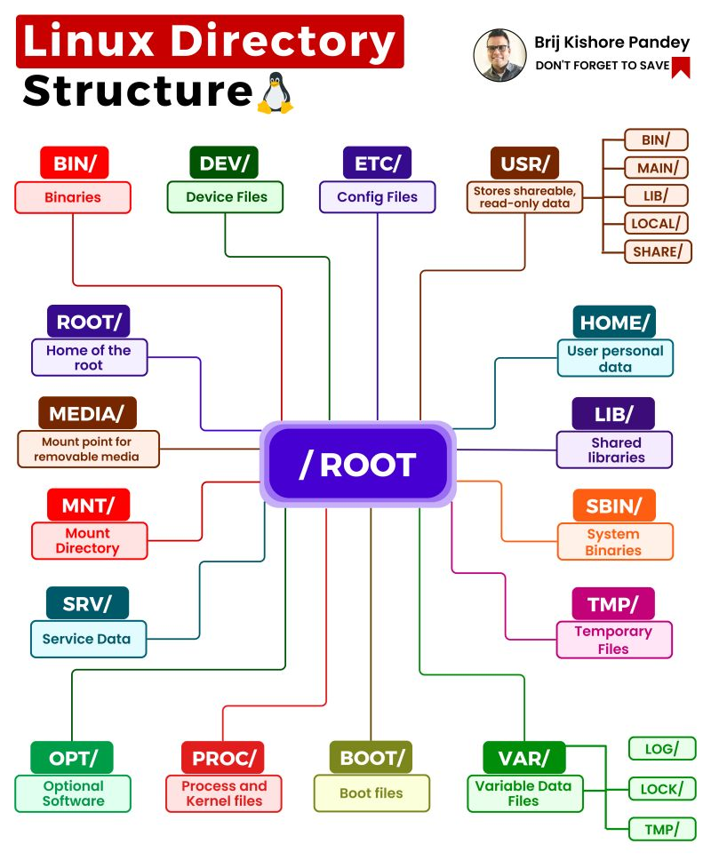

# Zarządzanie systemem

## Serwisy i demony

`/etc/systemd/system/`

`systemctl`

W większości dystrybucji Linuxa, zarządzanie serwisami i demonami odbywa się za pomocą [`systemd`](https://systemd.io). Wszystkie pliki konfiguracyjne znajdują się w katalogu `/etc/systemd/system/`.

Do zarządzania serwisami i demonami korzysta się z aplikacji `systemctl`. Poniżej znajdują się najważniejsze komendy:

- `systemctl start nazwa_serwisu` - uruchamia serwis
- `systemctl stop nazwa_serwisu` - zatrzymuje serwis
- `systemctl restart nazwa_serwisu` - restartuje serwis
- `systemctl status nazwa_serwisu` - sprawdza status serwisu. Pokazuje nie tylko status, ale także wyświetla logi.
- `systemctl enable nazwa_serwisu` - ustawia serwis do uruchamiania przy starcie systemu
- `systemctl disable nazwa_serwisu` - usuwa serwis z uruchamiania przy starcie systemu

TODO opisz same  pliki konfiguracyjne i ich syntax

## Logi systemowe

Do prostego wyświetlania logów kernela może być uzyta komenda dmesg

```bash
sudo dmesg
```

Przydatne flagi to:

- `-w` `--follow` - podążanie za kolejnymi logami
- `-T` - czas w formacie godziny (a nie liczony od startu)

Do bardziej zaawansowanych zastosowań można używać komendy journalctl.

Przykładowa komendy

```bash
journalctl --list-boots # wypisz ostatnie uruchomienia oraz ich czasy trwania
journalctl -b-1 # wyświetl logi tylko z ostatniego uruchomienia (oznaczonego jako -1)
```

## Domślne foldery systemowe



TODO opisz te najważniejsze dla mnie

- `/home/`
- `/mnt`
- `/tmp`
- `/`

## Firewalle i sieć

TODO
