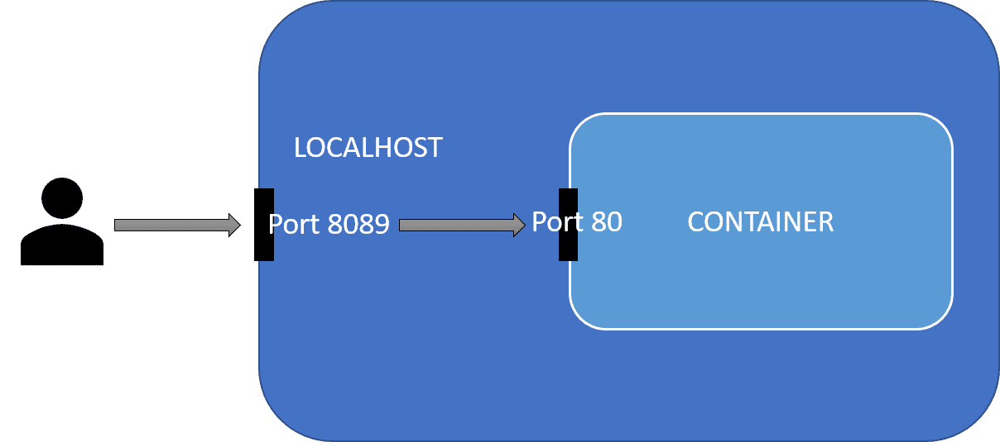

# Docker🐋

Docker jest jednym z najpopularniejszych obecnie systemów do wirtualizacji systemu operacyjnego.  
Pozwala w prosty sposób stworzyć instancję systemu będącą niemalże zupełnie niezależnym bytem od systemu maszyny na której się znajduje, może mieć ona zainstalowane zupełnie inne oprogramowanie, różnić się konfiguracją sieciową etc.  
Różni się on od zwyczajnej maszyny wirtualnej tym, że taki kontener jest dużo bardziej elastyczny od maszyny wirtualnej, ponieważ nie ma na stałe przydzielonych zasobów takich jak RAM, CPU etc.

Docker często jest wykorzystywany do pracy z różnorodnym oprogramowaniem bez niepotrzebnego zaśmiecania środowiska deweloperskiego. Jest to także jeden ze sposobów uniknięcia piekła zależności.

## Podstawowe Pojęcia

**Obraz/Image** - obrazy dockerowe są już gotowymi, wcześniej przygotowanymi paczkami zawierające systemy w dockerze. Przykładem obrazu jest `ubuntu:latest`.

**Kontener/Container** - jest to uruchomiona instancja naszego dockera bazująca na danym obrazie. Zawiera on konfigurację oraz wszystkie dane unikalne dla danej instancji.

**Repozytorium** - miejsce z którego pobierane są obrazy oraz ich aktualizacje. Jest to [dockerhub](https://hub.docker.com/), ale można też pobierać z innych repozytoriów (np z gitlaba).

## Obsługa

Mamy kilka grup komend

| Grupa     | Opis                                                                                                                                       |
| --------- | ------------------------------------------------------------------------------------------------------------------------------------------ |
| config    | Zarządzanie konfiguracją                                                                                                                   |
| container | Operacje na kontenerach                                                                                                                    |
| context   | Contexts for distributed deployment (k8s, …)                                                                                               |
| image     | Zarządzanie obrazami                                                                                                                       |
| network   | Zarządzanie siecią                                                                                                                         |
| service   | Service (i.e. multiple containers that run the same image) management in distributed deployments (e.g.with docker-compose or docker swarm) |
| system    | Global management                                                                                                                          |
| volume    | Secondary storage management                                                                                                               |

Do zarządzania możemy też używać apek GUI, albo pluginów do IDE.

### Zarządzanie obrazami

Do zarządzania obrazami na naszej maszynie służy polecenie `docker image`.

#### Nowy obraz

##### Baza

W większości wypadków warto wykorzystywać obrazy znajdujące się na stronie [hub.docker.com](https://hub.docker.com/) - zawiera ona zarówno obrazy większości dystrybucji Linuxa, jak i obrazy z systemami zawierające już przygotowane narzędzia deweloperskie (np obrazy zawierające zainstalowane i skonfigurowane bazy danych).

Aby pobrać taki obraz na naszą maszynę należy użyć komendy:

```bash
docker image pull [OPTIONS] NAME[:TAG|@DIGEST]
```

Na przykład:

```bash
docker image pull alpine:latest # pobiera najnowszy obraz systemu alpine
```

##### Budowanie z konfiguracji

Jeśli potrzebujemy stworzyć własny obraz to możemy go samodzielnie zbudować za pomocą komendy:

```bash
docker image build .
```

Pozwala ona zbudować nam własny obraz dockerowy na bazie pliku `dockerfile`. ([Opis składni](#składnia-pliku-dockerfile))

##### Stworzenie poprzez commita

Do wygenerowania nowego obrazu możemy też wykorzystać już istniejący kontener, wystarczy użyć komendy `commit`

```bash
docker commit containerName ImageName
```

#### Zarządzanie posiadanymi obrazami

Za pomocy komendy [`docker image ls`](https://docs.docker.com/engine/reference/commandline/image_ls/) możemy łatwo wypisać lokalnie pobrane obrazy.

```bash
docker image ls
REPOSITORY                                                TAG             IMAGE ID       CREATED         SIZE
<none>                                                    <none>          93c4e800ab68   2 weeks ago     677MB
postgres                                                  11-alpine       ec1e25ef56d1   5 weeks ago     156MB
alpine                                                    latest          6dbb9cc54074   5 weeks ago     5.61MB
nginx                                                     1.19.0-alpine   7d0cdcc60a96   11 months ago   21.3MB
```

[`docker image rm`](https://docs.docker.com/engine/reference/commandline/image_rm/) usuwa dany obraz.

```bash
docker image rm [OPTIONS] IMAGE [IMAGE...]
```

Ale do czyszczenia jednak lepsze jest [`docker image prune`](https://docs.docker.com/engine/reference/commandline/image_prune/), które usuwa wszystkie "wiszące" (dangling) obrazy, czyli np stare kopie obrazów, które zostały już przebudowane (na liście obrazów podpisane są jako `<none>`).  
Dodanie flagi `-a` usuwa także wszystkie obrazy, które są nie są używane przez żadne kontenery.

```bash
$ docker image prune -a
WARNING! This will remove all images without at least one container associated to them.
Are you sure you want to continue? [y/N] y
Deleted Images:
untagged: alpine:latest
```

#### Przenoszenie obrazów

Możliwe jest także zapisywanie istniejących obrazów do plików `.tar`.

Dzięki temu można je wczytywać na maszynach pozbawionych dostęþu do sieci.

```bash
docker save -o <path for generated tar file> <image name>
#na przykład
docker save -o ./image.tar ubuntu:20
```

Wczytuje się analogicznie

```bash
docker load -i <path to image tar file>
```

### Zarządzanie kontenerami

[`docker container ls`](https://docs.docker.com/engine/reference/commandline/container_ls/) - wypisuje kontenery obecnie uruchomione w systemie, dodanie flagi `-a` sprawia, że pokazuje także te wyłączone.

```bash
$ docker container ls -a
CONTAINER ID   IMAGE                                     COMMAND                CREATED       STATUS                PORTS  NAMES
bd1415cdc985   server_nginx                              "/docker-entrypoint.…" 25 hours ago  Exited(0) 24 hours ago       server_nginx_1
2474e0650b34   registry.gitlab.com/toolkit/server:latest "sh -c 'python manag…" 25 hours ago  Exited(0) 25 hours ago       server_web_1
ce6a641e20c1   postgres:11-alpine                        "docker-entrypoint.s…" 2 weeks ago   Exited(0) 21 hours ago       server_db_1
```

#### Uruchamianie

Do podstawowej pracy z kontenerem możemy używać komend:

- `docker container run` albo też `docker run`
- `docker container create`
- `docker container pause` / `unpause` - wstrzymuje (i wznawia) procesy w kontenerze
- `docker container start` / `stop` - zabija wszystkie procesy w kontenerze i go zamyka
- `docker container restart`
- `docker commit containerName ImageName` -zapisujemy zmiany wprowadzone w danym kontenerze jako nowy obraz

Do usuwania kontenerów służą `docker container prune` i `docker container rm`.

[`docker container create [OPTIONS] IMAGE [COMMAND] [ARG...]`](https://docs.docker.com/engine/reference/commandline/container_create/) - tworzy nam nowy kontener bazujący na danym obrazie, możemy także wybrać jaka komenda ma zostać w nim uruchomiona. (ale go nie uruchamia)  
Możemy go potem uruchomić komendą `docker container start ID`.

Do stworzenia nowego kontenera i natychmiastowego uruchomienia służy [`docker container run`](https://docs.docker.com/engine/reference/commandline/container_run/).

Przydatne flagi dla `docker run [flagi] nazwa-obrazu`:

- `-rm` usuwa kontener po zakończeniu pracy
- `-i`, `--interactive` po odpaleniu nadal mamy podłączone STDIN
- `-t`, `--tty` Podłączamy się terminalem do kontenera (warto użyć razem z `-i`)
- `-d`, `--detach` Uruchom kontener w tle i wypisz jego ID
- `-e`, `--env` Jakie zmienne środowiskowe mają być w naszym kontenerze (np `docker run -e BROKER_PORT=9999 client`)
- `-p`, `--publish` udostępnij wewnętrzne porty obrazu na portach hosta np `-p 8089:80` wystawia port 80 z wnętrza kontenera na porcie 8089 hosta. (możemy teraz na naszej maszynie otworzyć to pod adresem localhost:8089)
  
- `-v`, `--volume` określa jakie pliki/foldery z hosta mamy udostępnić kontenerowi i pod jakimi adresami np `-v /tmp/logs.log:/tmp/runlog` sprawi że apka w kontenerze pisząc do plików w folderze `tmp/runlog/` będzie tak na prawdę pisać do folderu `/tmp/logs.log/` na hoście.
- `--rm` - usuwa kontener po zakończeniu
- `--device` - pozwala na udostępnienie urządzeń kontenerowi dockerowemu (np. kamery) `--device=/dev/video0:/dev/video0` [link](https://docs.docker.com/engine/reference/run/#runtime-privilege-and-linux-capabilities)
- `--user` służy do ustawiania użytkownika oraz wartości userid (format: `<name|uid>[:<group|gid>]`) np. `--user=$(id -u):$(id -g)` ustawia uid oraz gid uzytkownika wewnątrz dockera na ten sam co ma użytkownik na hoście (moze to pomóc uniknąć problemów z uprawnieniami do plików)

```bash
docker container run -i -t ubuntu bash
```

#### Interakcje z działającym kontenerem

**attach** - podpinanie stdin i stdouta to działającego kontenera.  
`docker attach [OPTIONS] CONTAINER` lub `docker container attach`

**cp** - kopiowanie plików

**exec** - uruchom w już działającym kontenerze. Bardzo przydatne gdy chcemy np wejść tam z shellem.  
`docker exec [OPTIONS] CONTAINER COMMAND [ARG...]` lub `docker container exec ...`

```bash
docker exec -it worker bash #-it podpina input i output
```

### Zarządzanie wolumenami

**Ręczne tworzenie volume**

Czasami może pojawić się potrzeba ręcznego tworzenia wolumenów. [link](https://docs.docker.com/reference/cli/docker/volume/create/)

```bash
docker volume create [OPTIONS] [VOLUME]
```

Jedną z przydatnych opcji w takim wariancie jest stworzenie go w konkretnym folderze.

```bash
docker volume create --opt type=none --opt o=bind --opt device=/data/volumes/testvol testvol
```

Korzystamy wtedy z flag:

- `--driver` - określa jakiego sterownika użyć, domyślnie użwany jest `local`
- `--opt` - pozwala na przekazanie dodatkowych opcji sterownika (odpowiadają one opcjom komendy mount)
  - `type` określa typ wolumenu
  - `device` określa miejsce na dysku, które ma być zmapowane na ten wolumen (ten folder musi już istnieć)

**Usuwanie**

```bash
docker volume rm testvol
```

### Składnia pliku dockerfile

Plik [dockerfile](https://docs.docker.com/engine/reference/builder/#format) opisuje kolejne operacje pokazujące, jak powinien być zbudowany nasz obraz.

Przykładowy plik dockerfile:

```docker
# wybierz obraz bazowy od którego zaczynasz konstruowanie
FROM ubuntu:latest

# Ustaw zmienne środowiskowe
ENV APP_USER=user

# Wykonaj daną komendę, np zainstaluj potrzebne pakiety etc.
RUN apt install -y firefox

# określ położenie folderu roboczego w którym odpalane są komendy
WORKDIR /home/user

# Kopiuj pliki z hosta do systemu plików wewnątrz kontenera
COPY ./plik /home/user/
```

Tak zdefiniowany obraz budujemy komendą `docker build ./sciezka/folderu`.

Każda nowa linia/polecenie zaczyna się od komendy DUŻYMI_LITERAMI (taka konwencja).

Komendy:

- `FROM imageBase` to jest **zawsze** pierwsza instrukcja pokazująca na jakim innym obrazie ma bazować nasz nowy obraz
- `RUN command` wykonuje komendy w powłoce kontenera przy budowaniu
- `ENV variable value` ustawia wartości w środowisku (mogą być używane przez wszystko co będzie od teraz chodzić w kontenerze)
- `COPY source destination` kopiuje pliki ze źródła (URL, plik, folder) do miejsca w kontenerze (UWAGA! z przycyn bezpieczeństwa pozwala on tylko na kopie rzeczy tylko z folderu w którym uruchamiamy komendę, czyli nie możemy np skopiować sobie czegoś z katalogu `/home/jkowalski/pobrane`)
- `ADD source destination` to samo co `ADD` z różnicą, że gdy potrafi zorpakować archiwum, gdy jest ono podane jako plik
- `WORKDIR path` określa folder roboczy w którym mają się wykonywać pozostałe komendy jak `RUN`, `CMD`, `ENTRYPOINT`
- `CMD command arg1 arg2 ...` dostarcza domyślnych komend i wartości argumentów, które zostaną uruchomione w kontenerze
- `ENTRYPOINT command arg1 arg2 ...` uruchamia tą komendę, kiedy kontener jest uruchamiany (kontener jest zamykany kiedy ta komenda się kończy)
- `EXPOSE port` pokazuje na jakim porcie słucha kontaner, sama go nie wystawia, pełni raczej funkcję informacyjną dla użytkownika [link](https://docs.docker.com/engine/reference/builder/#expose)
- `VOLUME` pozwala kontenerowi podłączyć się do innego systemu plików [więcej info](https://docs.docker.com/storage/volumes/)
- `HEALTHCHECK` pozwala na sprawdzanie czy kontener jest gotowy do pracy [link](https://docs.docker.com/reference/dockerfile/#healthcheck)
  ```docker
  HEALTHCHECK --interval=5m --timeout=3s \
    CMD curl -f http://localhost/ || exit 1
  ```

**Uwaga** - w pliku dockerowym może być tylko jeden `CMD` albo `ENTRYPOINT`, jak nie to tylko `ENTRYPOINT` jest używany (na ogół).

#### ENTRYPOINT i CMD

ENTRYPOINT ma 2 warianty

- bazujący na samej komendzie

```docker
 ENTRYPOINT node app.js 9000 9001
```

- używany razem z CMD

```docker
ENTRYPOINT ["/bin/node","app.js"]
CMD ["9000","9001"]
```

I możemy to potem odpalić tak

```bash
docker build -t app
docker run app
docker run app 5555 5556 # gdy chcemy użyć własnych argumentów
```

Możliwe jest też ustawienie własnego entrypointa przy uruchomieniu.

```bash
# Executes bash -c "ls /"
docker run --entrypoint bash my-image:latest -c "ls /"
```

## Docker compose

Jest on wykorzystywany, kiedy potrzebujemy uruchomić wiele aplikacji, które będą się ze sobą komunikować (a odpalenie w dockerze skryptu, który wszystko nam poodpala nie jest opcją).

### Quick start

Wyobraźmy sobie, że potrzebujemy 3 apek, które gadają ze sobą.

Tworzymy plik `docker-compose.yml`

```yaml
version: '2'
services:
#Każdy z serwisów jest tutaj oddzielony
    cli:
        image: client #obraz z którego korzystamy
        build: ./client/
        links:
            - bro
        environment:
            - BROKER_HOST=bro
            - BROKER_PORT=9998
    wor:
        image: worker
        build: ./worker/
        links:
            - bro
        environment:
            - BROKER_HOST=bro
            - BROKER_PORT=9999
    bro:
        image: broker
        build: ./broker/
        # z wnętrza kontenera bro wystawiamy porty 9998 i 9999 aby inne
        # kontenery w composie mogły się do nich podpiąć (ale maszyna hosta nie)
        expose:
            - "9998“
            - "9999"
```

I uruchamiamy komendę `docker-compose up -d`, która:

- Buduje wszystkie wymagane obrazy (jeśli ich nie mamy)
- Uruchamia kolejne instancje każdego z nich w odpowiedniej kolejności

Do wyłączenia tego, co uruchomiliśmy wystarczy komenda `docker-compose down`

### Plik konfiguracyjny

//TODO opisz dokładniej syntax docker-compose na podstawie pliku tsr-ud04-eng-DockerReferenceDocs2122.pdf oraz https://docs.docker.com/compose/compose-file/

Plik `docker-compose.yml` służy do zdefiniowania całych grup kontenerów, która mają być odpalone razem na jednej maszynie ([pełna dokumentacja](https://docs.docker.com/compose/compose-file/)).Zawiera on opisy kolejno:

- serwisów (`services:`) - czyli poszczególnych obrazów dockerowych, które mają tworzyć całość (to jedyna obowiązkowa część, pozostałe są opcjonalne)
- sieci (`networks`) - czyli poszczególnych sieci
- woluminów (`volumes`) - trwałych miejsc do przechowywania plików
- sekretów (`secrets`)
- konfiguracji (`configs`)

??? note "Przykładowy docker compose"

    ```yaml
    services:
      frontend:
        image: awesome/webapp
        ports:
          - "443:8043"
        networks:
          - front-tier
          - back-tier
        configs:
          - httpd-config
        secrets:
          - server-certificate

      backend:
        image: awesome/database
        volumes:
          - db-data:/etc/data
        networks:
          - back-tier

    volumes:
      db-data:
        driver: flocker
        driver_opts:
          size: "10GiB"

    configs:
      httpd-config:
        external: true

    secrets:
      server-certificate:
        external: true

    networks:
      # The presence of these objects is sufficient to define them
      front-tier: {}
      back-tier: {}
    ```

#### Serwisy

Podstawowe parametry dla serwisów [dokumentacja](https://docs.docker.com/compose/compose-file/05-services/):

- `image` - obraz, którego ma używać dany serwis
- `expose` - lista portów, które mają być udostępnione innym serwisom wewnątrz dockera (host ich nie widzi)
- `ports` - lista portów wystawionych na zewnątrz dockera (są one także dostępne dla innych serwisów w dockerze)
- [`depends_on`](https://docs.docker.com/reference/compose-file/services/#depends_on) - lista serwisów, które muszą zostać wystartowane przed uruchomieniem tego serwisu (zastępuje on min przestarzałe pole `links`). Domyślnie ustawia on tylko kolejność startowania, ale nie sprawdza czy serwis jest już gotowy do pracy. W celu zapewnienia uruchomienia w odpowiednim momencie można użyć pola `condition` (wartości to `service_healthy`, `service_started` lub `service_completed_successfully`).
  ```yaml
  services:
    web:
      build: .
      depends_on:
        redis:
          condition: service_healthy
    redis:
      image: redis
      healthcheck: xxxxxxx
  ``` 
- [`healthcheck`](https://docs.docker.com/reference/compose-file/services/#healthcheck) - pozwala na sprawdzenie czy serwis jest gotowy do pracy (np. czy baza danych jest już dostępna). Można go zdefiniować także w pliku Dockerfile
- `environment` - lista zmiennych środowiskowych w danym kontenerze
- `build` - ścieżka do folderu z plikiem `Dockerfile`, aby go zbudować, gdyby jeszcze nie było odpowiedniego obrazu

//TODO dopisz przykłady

Inne parametry dla serwisów:

- `extra_hosts` - lista mapowań adresów na nazwy (pojawią się w pliku `/etc/hosts` na maszynie) [link](https://docs.docker.com/compose/compose-file/compose-file-v3/). Najbardziej użytecznym mapowaniem może być tutaj mapowanie `host-gateway`, które mapuje adres maszyny na której stoi docker.

```yaml
extra_hosts:
  - "somehost:162.242.195.82"
  - "innyhost.local:50.31.209.229"
  - "host.docker.internal:host-gateway"
```

#### Wolumeny

Za ich pomocą możemy tworzyć trwałe miejsca do przechowywania danych. Trwałych, czyli takich, które nie ulegają skasowaniu, kiedy usuwany jest kontener.  
Dlatego często są one wykorzystywane min. do przechowywania baz danych, abyśmy nic nie tracili wtdy, kiedy np. przy aktualizacji będziemy chcieli zmienić wersję kontenera na świeższą.  
Kolejną zaletą wolumenów w kontekście compose'a jest to, że mogą one być współdzielone pomiędzy poszczególnymi serwisami. [dokumentacja](https://docs.docker.com/compose/compose-file/07-volumes/)

Podstawowa składnia podawania wolumenów: `VOLUME:CONTAINER_PATH[:ACCESS_MODE]` [source](https://docs.docker.com/reference/compose-file/services/#short-syntax-5).   
Możliwe jest także użycie [złożonej składni](https://docs.docker.com/reference/compose-file/services/#volumes).

Przykład:

```yaml
services:
  backend:
    image: awesome/database
    volumes:
      - db-data:/etc/data
    #db-data będzie zamontowane w backendzie pod ścieżką /etc/data
      - type: bind
        source: /media/usb
        target: /usb
        bind:
          propagation: shared
    # zamontowany storage z hosta

  backup:
    image: backup-service
    volumes:
      - db-data:/var/lib/backup/data

#db-data to automatycznie zdefioniowany wolumen
#system stworzy go sobie najpewniej w lokacji /var/lib/docker
volumes:
  db-data:
```

Uruchamiając `docker compose up` docker tworzy wolument jeśli jeszcze nie istnieje.

Warto tytaj wiedzieć o [atrybutach](https://docs.docker.com/compose/compose-file/07-volumes/#attributes) takich jak:

- `external`(true, false) - określa, czy ten wolumen jest zarządzany poza wybranym docker composem. Jeśli ustawiony na `true` to wszystkie pozostałe flagi są ignorowane (za wyjątkiem name). Jeśli taki wolumen nie istnieje to zwracany jest błąd, jeśli istnieje to jest on podłączany.
  ```yaml
  volumes:
    db-data:
      external: true #szukamy czy volume o nazwie db-data istnieje
  ```
- `driver_opts` - pozwala na zamontowanie wolumentu za pomocą jakiegoś sterownika. Pozwala np. na stworzenie wolumenu znajdującego się na serwerze NFS
  ```yaml
  volumes:
  example:
    driver_opts:
      type: "nfs"
      o: "addr=10.40.0.199,nolock,soft,rw"
      device: ":/docker/example"
  ```
  lub zwyczajne określenie na jaki folder hosta ma być on zmapowany
  ```yaml
  volumes:
    cvat_share:
      driver_opts:
        type: none
        device: /mnt/duzy_dysk/pliki_dla_cvata/
        o: bind
  ```

Pracująz z wolumenami warto rozgraniczyć zwykłe wolumeny oraz [bind mounts](https://docs.docker.com/engine/storage/bind-mounts/). Różnią się one przede wszystkim tym, że wolumeny są zarządzane przed Dockera, a mounty przez system.  
Obejmuje to np sytuacje, kiedy chcemy mieć z dockera dostęp do folderu w którym jest storage montowany przez hosta ([bind propagation](https://docs.docker.com/engine/storage/bind-mounts/#configure-bind-propagation))

#### Wykorzystanie zmiennych środowiskowych

W ramach docker-compose możemy korzystać z zmiennych środowiskowych, które są zdefiniowane w pliku `.env` znajdującym się w tym samym folderze co plik `docker-compose.yml`. Może także korzystać ze zmiennych systemowych. [link](https://docs.docker.com/compose/how-tos/environment-variables/variable-interpolation/)

Przykład pliku `.env`:

```env
POSTGRES_USER=postgres
POSTGRES_PASSWORD=postgres
```

Aby skorzystać z tych zmiennych w pliku `docker-compose.yml` wystarczy użyć składni `${}`. Możemy też użyć domyślnych wartości, które są ustawiane w przypadku braku zmiennej.

```yaml
services:
  db:
    image: postgres
    environment:
      POSTGRES_USER: ${POSTGRES_USER}
      POSTGRES_PASSWORD: ${POSTGRES_PASSWORD}
      POSTGRES_DB: ${POSTGRES_DB:-postgres}
```

Składnia podstawień:

- `${VAR}` - podstawia wartość zmiennej `VAR`
- `${VAR:-default}` - podstawia wartość zmiennej `VAR`, jeśli jest ustawiona i nie jest pusta, w przeciwnym wypadku podstawia wartość `default`
- `${VAR-default}` - podstawia wartość zmiennej `VAR`, jeśli jest ustawiona, w przeciwnym wypadku podstawia wartość `default`
- `${VAR:?error message}` - Jeśli `VAR` nie jest ustawiona lub jest pusta to wypisuje `error message` i kończy działanie compose'a
- `${VAR+replacement}` - podstawia wartość `replacement` jeśli `VAR` jest ustawiona, w przeciwnym wypadku zostawia puste

#### inne

//TODO opisz pozostałe

### Komendy

UWAGA wkrótce komenda docker-ckompose powinna zostać zmieniona na `docker compose` [link](https://docs.docker.com/compose/reference/)

`docker-compose up` -

Parametry:

- `--scale service=num` pozwala odpalić więcej instancji danego serwisu (jednak gdy skalujemy serwisy, które wystawiają porty `expose` to tylko jedna z instancji będzie widoczna dla innych) //TODO sprawdź to
- `-d` -//TODO
- `-f` - flaga do [uruchamiania wielu plików docker compose jednocześnie](https://docs.docker.com/compose/reference/#specifying-multiple-compose-files) Jeśli wszystkie wysecyfikowane pliki znajdują się w tym samym folderze wtedy docker łączy je w jedną wspólną konfigurację.
  przykład apki z wtórej w dodatkowym pliku jest dodane szyfrowanie HTTPS:
  ```bash
  docker compose -f docker-compose.yml -f docker-compose.https.yml up -d
  ```

`docker-compose down` - zatrzymuje i **usuwa** kontenery z danego compose'a

`docker compose stop` - zatrzymuje, ale bez usuwania

`docker compose start` - uruchamia istniejące kontenery dla serwisu


## Przydatne snippety

### Tworzenie użytkownika

```docker
RUN useradd -ms /bin/bash -G sudo,inna_grupa dockeruser
#Wyłączenie promptu o hasło przy sudo
RUN echo "dockeruser ALL=(ALL) NOPASSWD: ALL" > /etc/sudoers.d/ubuntu
#ustawienie kolorowego terminala
ENV TERM=xterm-256color
#przełączenie na użytkownika przy dalszych komendach
USER dockeruser
WORKDIR /home/dockeruser
```

### Uruchamianie z dostępem do GUI

W wypadku aplikacji dockerowych możliwe jest ich uruchamianie aplikacji GUI z ich poziomu.

Wymaga to najpierw nadania uprawnień do otwierania okien

```bash
xhost +local: #Ta opcja jest aktywna do restartu komputera
```

Poza tym należy dać dockerowi dostęp do odpowiedniego gniazda oraz ustawić zmienną `DISPLAY`

```bash
docker run -it --rm -v /tmp/.X11-unix:/tmp/.X11-unix -e DISPLAY=$DISPLAY ubuntu bash
```

Do przetestowania działania całości warto użyć aplikacji `xeyes` znajdującą się w pakiecie `x11-apps` dla Ubuntu. W wypadku problemów warto dodać opcję `--ipc=host`.    
Jeśli ta metoda nie zadziała (na Waylandzie mogą być problemy) warto rozwazyć użycie https://github.com/mviereck/x11docker .


### Sprawdzanie rozmiaru dockera i ogólne czyszczenie

Aby otrzymać podsumowanie elementów dockerowych znajdujących się w systemie należy użyć komendy df

```bash
$ docker system df
TYPE            TOTAL     ACTIVE    SIZE      RECLAIMABLE
Images          16        16        34.44GB   6.447GB (18%)
Containers      23        23        146.5MB   0B (0%)
Local Volumes   18        14        806.6GB   2.222MB (0%)
Build Cache     116       0         0B        0B
```

Aby otrzymać konkretną listę trzeba dodać flagę `-v`.

Do czyszczenia można użyć następujących komend

```bash
docker container prune #usuwa wyłączone kontenery
docker image prune #usuwa obrazy, do których nie ma przypisanych tagów
docker builder prune #czyści build cache
```

#### Przenoszenie danych dockerowych

Domyślnie Docker przechowuje dane takie jak obrazy w folderze `/var/lib/docker/` w niektórych wypadkach warto zmienić to położenie na jakichś zewnętrzby dysk.

Aby to zmienić należy to ustawić za pomocą pola `data-root` w pliku `/etc/docker/daemon.json`. [link do stacka](https://stackoverflow.com/questions/24309526/how-to-change-the-docker-image-installation-directory), [Link do tutorialu o tym](https://blog.adriel.co.nz/2018/01/25/change-docker-data-directory-in-debian-jessie/)

Kroki:

1. Edytuj `/etc/docker/daemon.json`
2. Wyłącz dockera `sudo systemctl stop docker` i sprawdź czy już go nie ma `ps aux | grep -i docker | grep -v grep`
3. (opcjonalnie) Skopiuj obecne pliki dockera: `sudo rsync -axPS /var/lib/docker/ /new/path/to/docker-data`
4. Uruchom ponownie `sudo systemctl start docker`
5. Sprawdź położenie `docker info | grep 'Docker Root Dir'`
6. Usuń stare pliki `sudo rm -r /var/lib/docker`

## Wygodna praca z dockerkami

### Docker context

//TODO

[link docs](https://docs.docker.com/engine/manage-resources/contexts/)

```bash
docker create mojserwerek --docker "host=ssh://andrzej@192.168.1.111"
docker context use mojserwerek
# I od teraz wszystkie komendy dockerowe będą się wykonywały tak jakby na tej podłączonej maszynie 
docker ps
#i tu wypisze co chodzi na tym serwerze
```

### Deployment - Docker Stack i Docker swarm

[Artykuł - What is Docker Stack](https://www.ronaldjamesgroup.com/article/docker-stack)

Docker stack jest zbiorem narzędzi dockerowych, które mogą pomóc przy deploymentach opartych na dockerze i docker compose'ach.  
Pozwalają min. a zarządzanie grupami maszyn (Docker Swarm), stopniowe przełączanie pomiędzy aktualizacjami oprogramowania, cofanie się do poprzednich wersji (rollback), automatycznego spinania wszystkiego po sieci, oraz zarządzania sekretami.

Pierwszym krokiem jest tak czy siak utworzenie swarmu (potem możemy go sobie np rozszerzać).

```bash
docker swarm init
# Swarm initialized: current node (fl7k9wf1ywgykfajgni27f4nr) is now a manager.
#To add a worker to this swarm, run the following command:
#    docker swarm join --token SWMTKN-1-k,jhdasklnsal-dsbjiyen380qxk9jo1y7qd7wx 10.9.51.136:2377
# W razie czego można zobaczyć ten token znowu dzięki komendzie docker swarm join-token worker
```

Docker swarm używa compose'ów do deploymentu, więc komenda uruchamiająca nasz system to:

```bash
docker stack deploy -c ./docker-compose.yaml mojstack1
```

Nasze deploymenty są podzielone na stacki, dzięki czemu nie będą nam się one mieszać.


### Przydatne aplikacje do pracy z dockerem

[**skopeo**](https://github.com/containers/skopeo) - wygodna praca ze zdalnymi rejestrami dockerowymi

Może służyć do operacji takich jak:

- Listowanie istniejących tagów dla danego obrazu `skopeo list-tags ubuntu`
- Kopiowanie obrazów `skopeo copy docker://quay.io/buildah/stable docker://registry.internal.company.com/buildah`
- Synchronizowanie całych rejestrów `skopeo sync --src docker --dest dir registry.example.com/busybox /media/usb`

[**Dive**](https://github.com/wagoodman/dive) - sprawdzanie i eksplorowanie zawartości obrazów dockerowych oraz poszczególnych warstw.

```bASH
dive <your-image-tag>
```


