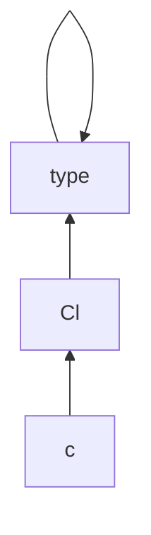

# Podstawy Pythona 🐍

## Quickstart

### Shebang

Jest to pierwsza linia skryptu (nie tylko w pythonie), która określa za pomocą czego ma być wykonany skrypt (może być to bash, zsh, python)
Mamy tutaj 2 możliwości:

Ta bardziej uniwersalna (działa z wieloma systemami operacyjnymi)

```python
#!/usr/bin/env python3
```

W tym wypadku używając flagi `-S` możemy dodać dodatkowe flagi do interpretera

```python
#!/usr/bin/env -S ptpython -i
```

Można też użyć bezpośredniej ścieżki, gdzie dodawanie parametrów jest nieco łatwiejsze.

```python
#!/usr/bin/python3
```

#### Interaktywny Python

Po dodaniu parametru `-i` nadal pozostaniemy w pythonie po wykonaniu skryptu, co pozwoli nam np zajrzeć do zmiennych, które były użyte, lub łatwo użyć klas, albo metod, które zostały zdefiniowane w skrypcie.

Jednak do nieco bardziej złożonych operacji w trybie interaktywnym warto rozważyć użycie innego pythona. Można tutaj np. użyć [ptpython](https://github.com/prompt-toolkit/ptpython), Ipython lub bpython. Dla wygody mozemy też zmienić interpreter w shebangu.

Jeśli nie chcemy używać innego interpretera możemy sobie nieco poprawić czytelność pythona w terminalu za pomocą biblioteki [rich](https://pypi.org/project/rich/).

### Funkcja main

wykonuje się, gdy skrypt jest uruchamiany jako samodzielny program, a nie jako moduł czegoś innego

```python
#!/usr/bin/python3 #warto to dać, aby system widział, że to skrypt w pythonie a nie np. w shellu
def main():
    print("Witaj świecie!")

if __name__ == "__main__":
    main()
```

#### Argumenty programu

```python
# Print total number of arguments
print ('Total number of arguments:', format(len(sys.argv)))

# Print all arguments
print ('Argument List:', str(sys.argv))

# Print arguments one by one
print ('First argument:',  str(sys.argv[0]))
print ('Second argument:',  str(sys.argv[1]))
```

Do parsowania bardziej skomplikowanych argumentów warto użyć biblioteki [argparse](https://docs.python.org/3/howto/argparse.html)

#### Zwracanie wartości

```python
sys.exit(numer)
```

### Funkcje we/wy

```python
pobrany_napis = input()
print("Twój napis to: " + pobrany_napis)
```

input() jest funkcją, która pobiera napis podany przez użytkownika ze standardowego wejścia (do entera) zwraca zmienną typu str

Dla strumieni:

```python
import sys

for line in sys.stdin:
    sys.stdout.write(line)
```

### Importowanie bibliotek etc

TODO

Przykładowe importy.

```python
import math

from collections import namedtuple

from django.contrib.auth.forms import (
    AuthenticationForm, PasswordChangeForm, PasswordResetForm, SetPasswordForm,
)
```

więcej informacji w [opisie paczek](./3_moduły_i_paczki.md).

## Podstawy

### Komentarze

```python
"""
Komentarz na
kilka linii
"""
#komentarz na jedną linię
```

### Zmienne

Deklarujemy je be określania ich typu `a=5` (interpreter automatycznie uzna, że to będzie int)
W odróżnieniu od takich języków jak C++, C# czy Java, w języku Python występuje typowanie dynamiczne. Oznacza to, że konkretny identyfikator, konkretna zmienna, np. a, może raz przechowywać napis ("Ala ma kota") by po chwili przechowywać liczbę całkowitą (3).
Do sprawdzania typu danych służy funkcja `type()`.

```python
logiczna = True
print(type(logiczna))
## <class 'bool'>
```

Najważniejsze typy zmiennych:

- `bool`, wartość logiczna, tak lub nie, prawda (True) albo fałsz (False)
- `int`, liczba całkowita, np. -7, 0 czy 3:
- `float`, czyli wartość zmiennopozycyjna, można ją utożsamiać z wartościami rzeczywistymi, np. -0.67, 1.0, 3.14
- `complex`, czyli liczba zespolona, np. -7+8.5j. Warto pamiętać, że w Pythonie jednostką urojoną jest j, a nie i
- `str`, powszechnie znany w innych językach jako string, czyli napis. Napis poznajemy głównie po tym, że jest zapisany w cudzysłowie (i to odróżnia go choćby od nazwy zmiennej czy liczby, które nie są w cudzysłowach). Dodamy, że w języku Python nie ma znaczenia, czy posługujemy się pojedynczymi (') czy podwójnymi (") cudzysłowami

Konwersja typów analogiczna dla przykładu poniżej

```python
print(int(5.3))
## 5
```

Operatory:

- dodawanie (`+`)
- odejmowanie (`-`)
- mnożenie (`*`)
- dzielenie (`/`)
- reszta z dzielenia, modulo (`%`)
  Analogiczne co C operatory `-=`, `*=`, `/=`, `%=`...
  UWAGA! Brak operatorów `++` i `--`
- `**` potęga
- `2+3j` liczba zespolona

Operatory Logiczne zwracają wartość logiczną (True/False)

- `<` - mniejsze
- `<=` - mniejsze równe, zwróćmy uwagę, że zapisujemy tak jak czytamy, nie ma operatora =< (równe mniejsze)
- `>` - większe
- `>=` - większe równe
- `==` - równa się. Tutaj bardzo ważne jest, aby odróżniać operator przypisania (=) od operatora porównania równa się (==). To bardzo częsty błąd wśród początkujących programistów. Operator = nie jest symetryczny, ma na celu przekopiowanie wartości z prawej do lewej. W niektórych językach zapisuje się go jako <- (ale nie w Pythonie). Operator = nie ma nic wspólnego z wartościami logicznymi. Za to operator == jest operatorem zwracającym wartość logiczną, a co więcej, jest on operatorem symetrycznym (nie ma znaczenia zamienienie kolejnością argumentów).
- `!=` - nie równa się
  Operator koniunkcji, `and`, utożsamiany z polskim i. Zwraca wartość True wtedy i tylko wtedy, gdy oba argumenty są równe True
  Operator alternatywy, `or`, utożsamiany z polskim lub. Zwraca wartość True wtedy i tylko wtedy, gdy przynajmniej jeden argument jest równy True
  Operator zaprzeczenia, `not`, utożsamiany z polskim nie. Zwraca wartość przeciwną, niż argument

Można łączyć kilka operatorów np:
`czy_wiek_produkcyjny = 18 <= wiek <= 65` - w pythonie porównania rozwijane są tak jak w matematyce, czyli np możemy też napisać `2 <= 4 < 8`, co zwróci nam `True`

Inne operatory:

- `is` - czy dwie zmienne są różnymi instancjami tego samego obiektu

```python
s1={}
s2={}

s1==s2
#True

s1 is s2
#False ##ponieważ to nie jest ten sam słownik
```

- `in` używany do sprawdzenia, czy dana wartość/obiekt zawiera się w liście/słowniku/secie...

```python
zbior = {1, 3, 5}
zbior_pusty = {}

print(1 in zbiorPusty)
## False
print(1 in zbior)
## True
```

Instrukcja warunkowa if

```python
if warunek:
    instrukcja1
    instrukcja2
elif warunek2: # gdy warunek nieprawdziwy, sprawdź warunek2
    instrukcja3
    instrukcja4
elif warunek3: #gdy warunek2 nieprawdziwy, sprawdź warunek3
    instrukcja5
    instrukcja6
else: #gdy zaden z warunków nie byl prawdziwy
    instrukcja7
    instrukcja8
```

Warto także pamiętać o jedno-linijkowym wariancie if-a:

```python
# a if condition else b
print("Prawda") if True else print("Fałsz")
#Prawda
```

#### Pusta zmienna

Czasem `_` jest używane jako pusta zmienna jest to swego rodzaju odpowiednik `/dev/null`

TODO dopisać i omówić przykłady:
<https://stackoverflow.com/questions/5893163/what-is-the-purpose-of-the-single-underscore-variable-in-python>

### Pętle

Po `for` (`foreach`) może się znajdować lista (obrót dla każdego elementu)
Po while warunek logiczny (obroty dopóki prawda)

```python
for i in range(0, 4):
print(i)

## 0
## 1
## 2
## 3

#lub
i = 0
while i < 4:
print(i)
i+=1

liczby = [2, 3, 5]
for liczba in liczby:
print(liczba)
## 2
## 3
## 5
```

Słowo kluczowe `continue` przerywa dany obrót pętli
Słowo kluczowe `break` przerywa całą pętlę

Jeśli iterujemy po liście krotek możemy sobie je rozbić

```python
for i, line in enumerate(strings_list): #enumerate zwraca dla danej listy krotkę zawierającą numer i element z listy
    ###jakiś kod
```

#### Pętle jednolinijkowe (List Comprehensions)

Jednolinijkowe pętle zwracające np listę dobre dla prostych operacji, użyteczne do szybkiego generowania tablic.

```python
newlist = [expression for item in iterable if condition == True]
#albo bez if-a
newlist = [x for x in range(10)]

fruits = ["apple", "banana", "cherry", "kiwi", "mango"]
newlist = []

for x in fruits:
  if "a" in x:
    newlist.append(x)

#daje to samo co:

newlist = [x for x in fruits if "a" in x]
```

### Struktury danych

#### Krotka (tuple)

Pewną specyficzną dla języka Python strukturą jest krotka. Polega ona na grupowaniu paru wartości w jeden byt. Warto zaznaczyć, że krotka, która raz została stworzona, nie może być modyfikowana: nie możemy podmienić jednej ze składowych krotki

```python
krotka = (2,3)
print(krotka)
## (2, 3)
```

Gdybyśmy chcieli uzyskać poszczególne składowe krotki, możemy to zrobić przy użyciu operatora kwadratowych nawiasów. W Pythonie, tak jak w wielu językach programowania, numerujemy składowe od 0:

```python
pierwsza = krotka[0]
druga = krotka[1]
print(pierwsza)
## 2
print(druga)
## 3
W krotce możemy mieszać typy danych:
krotka = (2, "Napis")
print(krotka)
## (2, 'Napis')
len(krotka) #długość krotki
## 2
```

Kiedy krotka może być przydatna? Np. gdy chcemy zwrócić więcej niż jedną wartość w funkcji.

```python
def f(x):
    y0 = x + 1
    y1 = x * 3
    y2 = y0 ** y3
    return (y0, y1, y2)
```

Jeśli chcemy możemy rozbić krotkę na poszczególne zmienne

```python
a,b,c = (1,2,3)
```

##### named tuple

Specjalne obiekty działające jak krotki i kompatybilne z nimi.

```python
from collections import namedtuple
Point = namedtuple('Point', 'x y')
pt1 = Point(1.0, 5.0)
pt2 = Point(2.5, 1.5)

from math import sqrt
# wskazanie poprzez indeks
line_length = sqrt((pt1[0]-pt2[0])**2 + (pt1[1]-pt2[1])**2)
 # rozpakowanie krotki
x1, y1 = pt1
```

##### Funkcja zip

Do operowania na krotkach przydatna jest funkcja wbudowana `zip` zwracająca iterator (nie listę) pozwalający iterować po krotkach tworzonych z obiektów danych w funkcji.

```python
a = ("John", "Charles", "Mike")
b = ("Jenny", "Christy", "Monica", "Vicky") # wartości nadmiarowe są pomijane

for kr in zip(a, b):
    print(kr)

#('John', 'Jenny')
#('Charles', 'Christy')
#('Mike', 'Monica')
```

#### Lista

Podobną, przynajmniej na pozór, strukturą danych do krotki jest lista. Tutaj także możemy grupować dane oraz nie muszą one być tego samego typu. Jednak główną różnicą jest to, że listę możemy modyfikować. Możemy dodawać nowe elementy czy zastępować dotychczasowe.

```python
lista = [1, False, "Napis"]
print(lista)
## [1, False, 'Napis']
print(len(lista))
## 3
lista.append(2.5+3.7j)
print(lista)
## [1, False, 'Napis', (2.5+3.7j)]
lista.extend([97,98,99]) # metoda podobna po append, która przyjmuje jako argument całą listę i dodaje z niej kolejne elementy
print(lista)
## [1, False, 'Napis', (2.5+3.7j), 97, 98, 99]
```

Operatory `+` i `*` mają zdefiniowane działanie w kontekście list.
`+`, tak jak w przypadku napisu, to konkatenacja, czyli połączenie dwóch list w jedną
`*` zaś pozwala nam powielić daną listę:

```python
print(lista + [7,8,9])
## [1, False, 'Napis', (2.5+3.7j), 97, 98, 99, 7, 8, 9]
print([7,8,9] * 3)
## [7, 8, 9, 7, 8, 9, 7, 8, 9]
```

Odwołanie się do konkretnego elementu następuje tak jak w krotce:

```python
print(lista[2])
## Napis
! ujemne indeksy oznaczają pozycje liczone od tyłu
print(lista[-1])
## 99
```

Ogólna składnia indeksowania wygląda tak: `[od:do:krok]`. Domyślnie `od` to 0, `do` to długość listy, a `krok` to 1.

```python
Odwoływanie się do wycinka listy
print(lista[2:5])
## ['Nowy', (2.5+3.7j), 97]
Elementy o numerach 2, 3, 4 (bez 5)

"ala ma kota"[-4::] #elementy od trzeciego od końca aż do ostatniego
#"kota"

"123456789"[::2] #co drugi element
#13579
"123456789"[::-1] #odwrócenie listy
#987654321
```

Podmiana

```python
lista[0:3] = [98,99,101,102]
print(lista)
## [98, 99, 101, 102, (2.5+3.7j), 97, 98, 99]
```

Usuwa 3 pierwsze elementy i na ich miejsce wstawia te podane

Wstawienie elementu w innym miejscufor klucz in bazaDanychPolakow.keys():

```python
print(klucz)

for wartosc in bazaDanychPolakow.values():
print(wartosc)

for klucz, wartosc in bazaDanychPolakow.items(): ##Tutaj items() zwraca krotkę
print(klucz)
print(wartosc)
print("-----")


lista.insert(1, "Nowy2")
print(lista)
## [98, 'Nowy2', 99, 101, 102, (2.5+3.7j), 97, 98, 99]
Usunięcie elementu
del lista[1]
print(lista)
## [98, 99, 101, 102, (2.5+3.7j), 97, 98, 99]
Napisy
Zmienna w napisie
zmienna = 7
napis = f"wartość zmiennej to {zmienna}"
print(napis)
## wartość zmiennej to 7
wieleWierszy = """Tutaj pierwszy
a tu drugi
tutaj trzeci"""
print(wieleWierszy)
## Tutaj pierwszy
## a tu drugi
## tutaj trzeci
```

Kolejność alfabetyczna

```python
print("a" < "b")
## True
```

Więcej na:
<https://www.kodolamacz.pl/blog/wyzwanie-python-3-algorytmy-i-struktury-danych/>

#### Zbiór (set)

to tablica (tyle, że bez indeksowania), w których nie ma dwóch lub więcej identycznych elementów. (jest szybszy od listy)

```python
zbiorPusty = set()
zbior = {1, 3, 5}
print(zbiorPusty)
## set()
print(zbior)
## {1, 3, 5}
zbior.add(2) ##Dodawanie elementu
zbior.discard(2) ##Usuwanie elementu
Można w nim łatwo sprawdzać, czy dany element należy do zbioru
print(1 in zbiorPusty)
## False
print(1 in zbior)
## True
print(1 not in zbiorPusty)
## True
```

Możemy na nich wykonać typowe operacje teoriomnogościowe, jak suma, różnica czy przecięcie dwóch zbiorów

```python
print({1,5,8} | {1,5,9}) # suma
## {1, 5, 8, 9}
print({1, 5, 8} - {1, 5, 9}) # różnica

## {8}
print({1, 5, 8} & {1, 5, 9}) # przecięcie
## {1, 5}
Można zapytać, czy jeden zbiór jest podzbiorem drugiego
print({1, 5}.issubset({1, 5, 9}))
## True
```

#### Słownik

Jest to rozszerzenie idei zbioru.
Słownik zawiera pary klucz-wartość. Wyszukiwanie po kluczu jest szybkie, tak jak w zbiorze, jednak gdy już odnajdziemy klucz, możemy odzyskać także stowarzyszoną z nim wartość. Gdy usuniemy ze słownika wartości, a zostawimy same klucze, otrzymamy zbiór. Tak jak w zbiorze, w słowniku klucze nie mogą się powtarzać.

```python
bazaDanychPolakow = {"89082911111" : ["Jan", "Kowalski", 29],
"95092200000" : ["Ania", "Nowak", 23],
"98122422222" : ["Adam", "Mickiewicz", 220]
}
bazaDanychPolakow["88081244444"] = ["Magda", "K", 30] #Dodanie nowej pary klucz-wartość
del bazaDanychPolakow["88081244444"] #Usunięcie danej pary
```

Tak jak w zbiorze możemy sprawdzać, czy klucz znajduje się w słowniku.

Uzyskanie wartości stowarzyszonej z kluczem

```python
print(bazaDanychPolakow["98122422222"])
## ['Adam', 'Mickiewicz', 220]
Gdy chcemy zabezpieczyć się przed odwołaniem do nieistniejącego elementu (i w tym wypadku zwrócić wartość domyślną), użyjemy metody get():
print(bazaDanychPolakow.get("89082911111", "wartość domyślna"))
## ['Jan', 'Kowalski', 29]
print(bazaDanychPolakow.get("95092200022", "wartość domyślna"))
## wartość domyślna
```

Przejście w pętli

```python
for klucz in bazaDanychPolakow.keys():
print(klucz)

for wartosc in bazaDanychPolakow.values():
print(wartosc)

for klucz, wartosc in bazaDanychPolakow.items(): ##Tutaj items() zwraca krotkę
print(klucz)
print(wartosc)
print("-----")
```

Przy printowaniu słowników (zwłaszcza tych skomplikowanych) warto użyć `pprint`

```python
import pprint
pprint.pprint(duzy_slownik)
```

#### Kolejka

Kolejka jest kolejną przydatną strukturą danych. Najczęściej jest ona używana do przechowywania danych w kolejce fifo. W pythonie mamy tak właściwie 2 implementacje [`queue.Queue`](https://docs.python.org/3/library/queue.html#queue.Queue) i  `collections.deque`. Pierwsza z nich jest zalecana głównie do komunikacji i wymiany komunikatami między wątkami, zaś druga jest po prostu strukturą danych. Z tego powodu klasa `queue.Queue` ma metody związane z dostępem, jak np `put_nowait()`, czy `join()`, ale brakuje jej np operatora `in`.

```py
from collections import deque

q = deque([1,2,3,4])
q.popleft()
# 1
print(q)
# deque([2, 3, 4])
q.pop()
# 4
q.index(2)
# 0 - indeks elementu 2
q.append(99) # dodaj 99 na koniec
q.extend([100,101])
print(q)
# deque([2, 3, 99, 100, 101])
```

#### Sterta (heap)

Kolejną typową strukturą jest sterta/kopiec (heap) pozwalająca dorzucać do niej elementy, które można potem efektywnie zdejmować (przy założeniu, że chcemy je zdejmować od najmniejszych).


W pythonie sterta jest zaimplementowana za pomocą biblioteki [`heapq`](https://docs.python.org/3/library/heapq.html). Jej metody pozwalają traktować listę jak stertę. 

```py
import heapq

h = [10, 20, 15, 30, 40]
# zmienia listę w stertę dającą dostęp od najmniejszego elementu
heapq.heapify(h)
# elementy na stercie mogą być krotkami, gdzie porównywane są kolejne wartości
heapq.heappush(h, 5) 
heapq.heappop(h)
#> 5
```

### Funkcje

Funkcje

```python
def nazwaFunkcji(parametry, oddzielone, przecinkami):
return wynik
Wartości domyślne parametrów
def potega(podstawa, wykladnik=1):
#ciało funkcji
Argumenty nazwane Możemy podawać argumenty w dowolnej kolejności, gdy podamy ich nazwy
print(potega(wykladnik = 4, podstawa = 3))
## 81
```

```python
def printinfo( name, age = 35 ):
   "Prosta funkcja z domyślnymi wartościami"
   print("Name: ", name)
   print("Age ", age)
   return
```

Funkcja może także przyjmować wiele argumentów

```python
#** - zmienne będą interpretowane jako krotka
def printinfo( arg1, *krotka ):
   print("Output is: ")
   print(arg1)
   for var in krotka:
      print(var)
   return
#** - zmienne będą interpretowane jako słownik
def printinfo2( arg1, **slownik ):
   print( "Output is: ")
   print(arg1)
   for key in slownik.keys():
      print(key)
   return

printinfo( 10 )
printinfo( 70, 60, 50 )
printinfo2("argum1",klucz1=wart1,klucz2=wart2,klucz3=523,pusty=None) #ważne, aby słownik był definiowany jako słownik, czyli klucz=wartosc
```

W pythonie jedna funkcja może zwracać różne rzeczy, obiekty, zmienne, nic.

```python
def returnOrNot(return_bool=True):
    if return_bool:
        return True
    return

```

#### Adnotacje

W wypadku funkcji możemy też dodać adnotacje (typowanie zmiennych) do ich argumentów oraz wartości zwracanych (nie są one wykorzystywane przez interpreter, ale ułatwiają dokumentowanie).
(Uwaga, tej funkcji nie ma w pythonie 2, dla niego jest [workaround o nazwie type comments](https://realpython.com/lessons/type-comments/) )

```python
def funkcja( liczba1:99=12 , slowo1:str="sl", slowo2:"inne slowo"="inne") -> str:
    #some code
    return "slowo"


slowo: str = "inne_slowo"
```

Można potem je sprawdzić poprzez sięgnięcie do atrybutu `__annotations__`

```python
>>>funkcja.__annotations__
{'liczba1': 99, 'slowo1': <class 'str'>, 'slowo2': 'inne slowo', 'return': <class 'str'>}
```

W niektórych wypadkach może pojawić się potrzeba zaimportowania oczekiwanych elementów

```python
from typing import Tuple
def foo(x:int, y:int) -> Tuple[int, int]:
    return (x*y, y//2)
```

Możliwe są też adnotacje dla elementów klasy [PEP-526](https://peps.python.org/pep-0526/)

```python
class Starship:
    stats: ClassVar[dict[str, int]] = {} # class variable - pole klasy
    damage: int = 10                     # instance variable - pole instancji
```

W razie problemów spowodowanych kolejnością deklaracji różnych elementów w pliku warto użyć specjalnego importu

```python
from __future__ import annotations # bez niego poniższy kod by nie działał

def fun(i: A): #moglibyśmy otzymać błąd mówiący o odnoszeniu się do nieistniejącej klasy
    pass

class A:
    pass
```

#### Wyrażenia lambda

Lambdy to są funkcje, które można w dość podręczny sposób zdefiniować

```python
#Ogólna definicja
lambda arg1, arg2, arg3: nasze_wyrazenie #ta lambda zwróci wartość naszego wyrażenia

nasza_lambda = lambda x: x*2
nasza_lambda(2)
#>4

```

Argumenty w lambdach można zapisywać tak samo jak w zwykłych funkcjach, mogą tam być wartości domyślne,

#### Zasięg i zmienne globalne

W pythonie na ogół funkcje nie mogą edytować (mogą mieć dostęp, ale nie edytować) zmienne poza swoim zakresem.

```python
c = 1 # global variable

def add():
    print(c)
    c = c + 2 # increment c by 2
    print(c)

add()
#>2
#>UnboundLocalError: local variable 'c' referenced before assignment
```

Aby móc je jednak zmieniać jest używane słowo kluczowe `global`.

```python
c = 0 # global variable

def add():
    global c
    c = c + 2 # increment by 2
    print("Inside add():", c)

add()
print("In main:", c)
#>Inside add(): 2
#>In main: 2
```

#### Przekazywanie dowolnych argumentów (\*\*kwargs i \*args)

Pozwalają one na umieszczeanie argumentów o dowolnej liczbie i nazwie w naszej funkcji. **args** przyjmuje je jako listę kolejnych elementów, zaś **kwargs** przyjmuje je jak słownik.

```python
def parametr_args(*args):
    print("zawartość args: {}".format(args))

parametr_args('python', 'spam', 'eggs', 'test')
###zawartość args: ('spam', 'eggs', 'test')

def parametr_kwargs(argument, **kwargs):
    print("argument: {}".format(argument))
    print("zawartość kwargs: {}".format(kwargs))

parametr_kwargs(dodatkowy=48, nastepny=111, argument=12)

# argument: 12
# zawartość kwargs: {'dodatkowy': 48, 'nastepny': 111}
```

//TODO <https://printpython.pl/poczatki/zadanie-z-gwiazdka/>

#### Dekoratory funkcji

Jest to element pozwalający na opakowanie naszej funkcji za pomocą innej funkcji, aby wzbogacić jej funkcjonalność.  
Funkcja dekorująca najczęściej przyjmuje funkcję dekorowaną i zwraca nową, wynikową funkcję, która ma zostać wykonana.

```python
#foo jest dekoratorem, który wzbogaci naszą funkcję
def foo(to_be_wrapped):
    @wraps(to_be_wrapped) #(opcjonalne) dodanie tej linii pozwala na zachowanie oryginalnej nazwy funkcji oraz jej dokumentacji
    def new_func(args,**kwargs):
        print("uwaga, będzie sześcian")
        return to_be_wrapped(*args,**kwargs)  # warto je dodać aby argumenty zostały przekazane dalej do funkcji docelowej

    return new_func

@foo #jeśli dodamy ten dekorator to użycie tej funkcji zostanie zmienione, tzn zamiast oryginalnej funkcji cube() otrzymamy "wzbogacone" cube drukujące komunikat przed drukowaniem
def cube(d):
    return d ** 3 #podniesienie do potęgi 3

cube(2)
#uwaga, będzie sześcian
#8
```

Ale warto pamiętać, że jeśli chcemy przygotowywać takie dekoratory wewnątrz klas to musimy pamiętać, żę nieco inaczej wygląda dostęp do `self`

```python
class Myclass:
    # wydaje mi się, że tutaj dekorator musi być zdefiniowany jako pierwszy
    def _add_loaded_location_to_token(decorated_fun, *args, **kwargs):
        def output_fun(*args, **kwargs):
            t = decorated_fun(*args, **kwargs)
            t.location = args[0].current_location # po prostu self jest schowany pod pierwszym z argumentów
            return t

        return output_fun

    @_add_loaded_location_to_token
    def get_token(self):
        #kod
        return token
```

Dekorator przyjmujący argumenty. Aby dekorator mógł przyjąć argumenty, musi być zdefiniowany jako funkcja, która zwraca dekorator.

```python
def retry(tries=4):
    def decorator(func):
        @wraps(func)
        def wrapper(*args, **kwargs):
            for i in range(tries):
                try:
                    return func(*args, **kwargs)
                except Exception as e:
                    print(f"Exception {e}, retrying")
            return None
        return wrapper
    return decorator

@retry(5)
def download_file(url):
    #kod
```

#### overload (przeciążanie funkcji)

W Pythonie możliwe jest także przeciążanie funkcji oraz metod. Można do tego celu użyć dekotarota [`@overload`](https://peps.python.org/pep-3124/).  
Pozwala on zdefiniować alternatywne implementacje funkcji.

```py
from overloading import overload
from collections import Iterable

def flatten(ob):
    """Flatten an object to its component iterables"""
    yield ob

@overload
def flatten(ob: Iterable):
    for o in ob:
        for ob in flatten(o):
            yield ob

@overload
def flatten(ob: basestring):
    yield ob
```

//TODO zweryfikować czy używanie tego jest dobrą praktyką

### Statyczne pola funkcji

Odpowiednikiem zmiennych typu `static` wewnątrz funkcji jest pole funkcji. [źródło](https://stackoverflow.com/questions/279561/what-is-the-python-equivalent-of-static-variables-inside-a-function)

```python
def myfunc():
  myfunc.counter += 1
  print myfunc.counter

# atrybut musi być gdzieś zainicjalizowany
myfunc.counter = 0
```

Można też dodać atrybut w ten sposób:

```python
def myfunc():
  if not hasattr(myfunc, "counter"):
     myfunc.counter = 0  # it doesn't exist yet, so initialize it
  myfunc.counter += 1
```

## Obiektówka

### Obiekt

```python
class Osoba: #Definicja klasy o nazwie Osoba
    ile = 0 # pole klasy
    imie: str # adnotacja typu dla pola instancji
    def __init__(self, imie, nazwisko, wiek): #Definicja konstruktora
        self.imie = imie
        self.nazwisko = nazwisko
        self.wiek = wiek
    def przedstaw_sie(self):
        print(f"Jestem {self.imie} {self.nazwisko}. Mam {self.wiek} lat.")
    def urodziny(self):
        wiek_przed = self.wiek
        self.wiek += 1
    return wiek_przed
    def __del__(self): # destruktor, czyli kod, który wykonuje się podczas niszczenia obiektu
    @staticmethod
    def policz():
        return Osoba.ile
```

Obiekty w pythonie nie mają pól statycznych działających tak jak w innych językach (jak np C++). Tutaj zmiana pola klasy nie zmienia wartości tego pola dla innych instancji [link](https://stackoverflow.com/questions/68645/static-class-variables-and-methods-in-python).

#### Metody

Metodę możemy poznać min. także po pierwszym argumencie: `self`.
W języku Python metody przyjmują jako pierwszy parametr obiekt, na rzecz którego są wywoływane. W samym wywołaniu nie musimy go sami podawać. Wystarczy, że metoda jest napisana po kropce. Następnie następują trzy zwykłe parametry: imie, nazwisko oraz wiek.

##### Konstruktor i destruktor

Jest to taka metoda, która jest wywoływana, gdy obiekt jest tworzony. Jej celem jest zainicjowanie pól w instancji. Tu są definiowane parametry klasy.
Konstruktor poznajemy po jego specjalnej nazwie: `__init__`.
Analogicznie działa destruktor (nazwa: `__del__`)
Przy wywołaniu pomijamy argument self.

```python
Jan = Osoba("Jan", "Nowak", 48)
Jan = None #Wymuszenie destrukcji obiektu
```

Kiedy interpreter napotka kod `Foo()` dzieją się następujące rzeczy:

- Wołana jest metoda `__call__()` dla klasy po której `Foo` dziedziczy (domyślnie to jest klasa `type`)
- metoda `__call__()` woła odpowiednio:
  -  `__new__()` - new tworzy nową instancję klasy (po więcej szczegółów sprawdź [metaklasy](#metaklasy) )
  -  `__init__()` - init ją inicjalizuje (z tego powodu on nie musi nic zwracać)

##### Własne operatory

W pythonie można w prosty sposób dodawać własne operatory do klas. Możemy w prosty sposób sprawić, że korzystanie z naszych klas będzie wygodniejsze.

```python
class C:
    __str__(self):

```

| Operator | Nazwa funkcji                  | Opis                                                                             |
| -------- | ------------------------------ | -------------------------------------------------------------------------------- |
| `str()`  | `__str__(self)`                | Funkcja generująca stringa dla danej klasy. Przydatne do debugowania i nie tylko |
| `+`      | `__add__(a,b)`                 | Dodawanie                                                                        |
| `[]`     | `__getitem__(self,index)`      | Te kilka jest potrzebne do poprawnego zaimplementowania operatora `[]`           |
| `[]`     | `__setitem__(self,index,item)` |                                                                                  |
| `[]`     | `__delitem__(self.index)`      |                                                                                  |

[Pełniejsza lista operatorów](https://docs.python.org/3/library/operator.html)
TODO popraw i rozbuduj

#### Widoczność elementów

W języku Python nie ma pól prywatnych w klasie: nie jesteśmy w stanie w praktyce czegokolwiek “ukryć”. Jednak są pewne zasady nazewnictwa, które działają raczej na zasadzie porozumienia, niż będące prawdziwą barierą. I tak, gdy poprzedzimy nazwę jednym znakiem podkreślenia `_`, oznajmiamy, że dany element nie jest uwzględniony w dokumentacji, może się zmienić, raczej nie należy z niego korzystać, a środowisko programistyczne nie będzie nam go podpowiadać. Przykładowo pole `_imie`, np. `self._imie`, czy `self._metoda()`.

Gdy użyjemy dwóch znaków podkreślenia `__`, zachowanie jest trochę inne: dane pole czy metoda nie będzie widoczna pod tą nazwą wcale, ale za to będzie można się do niego odwołać (dla nazwy `__element`) poprzez `_nazwaklasy.__element`.

#### Statyczne

Dla odmiany są one tworzone poza konstruktorem. Do pola tego odwołujemy się poprzez nazwę klasy. Np `Osoba.ile`
Sama metoda statyczna ma nad sobą napis `@staticmethod`. To tzw. [dekorator](#dekoratory-funkcji).
Metoda statyczna nie może odwoływać się do instancyjnych pól (czyli tych zwykłych, jak imie z poprzedniego przykładu), a jedynie do statycznych. Wynika to z faktu, że metoda statyczna nie jest wywoływana na rzecz konkretnego obiektu, który by takie właśnie pola miał.

Jeśli jednak chcemy aby nasza metoda miała jakieś informacje na temat naszej klasy można użyć dekoratora `@classmethod`, który różni się tym, że klasaobiektu (nie instancja) jest przekazywana dalej. [Porównanie na stacku](https://stackoverflow.com/questions/136097/difference-between-staticmethod-and-classmethod)

```python
class A(object):
    def foo(self, x):
        print(f"executing foo({self}, {x})")

    @classmethod
    def class_foo(cls, x):
        print(f"executing class_foo({cls}, {x})")

    @staticmethod
    def static_foo(x):
        print(f"executing static_foo({x})")
```

### Dziedziczenie

```python
class Zwierze:
    def __init__(self, nazwa, wiek, waga):
        self.nazwa = nazwa
        self.wiek = wiek
        self.waga = waga
    def przedstaw_sie(self):
        print(f"Jestem zwierzęciem {self.nazwa}, mam {self.wiek} lat oraz wazę {self.waga} kg.")
    def urodziny(self):
        self.wiek += 1

class Mrowka(Zwierze):
    pass #Oznacza, że ciało jest puste

class Slon(Zwierze):
    def przedstaw_sie(self):
        print(f"Jestem słoniem {self.nazwa}, mam {self.wiek} lat oraz wazę {self.waga} kg.")

class Lew(Zwierze):
    def przedstaw_sie(self):
        super().przedstaw_sie()
        print("A tak w ogóle to jestem lwem")

class Papuga(Zwierze):
    def __init__(self, nazwa, wiek, waga, kolor):
        super().__init__(nazwa, wiek, waga)
        self.kolor = kolor
    def przedstaw_sie(self):
        super().przedstaw_sie()
        print(f"Jako papuga mój kolor to {self.kolor}")
```

`super()` zwraca nam instancję klasy bazowej: są to wszystkie pola i metody naszego obiektu, jakie otrzymaliśmy dzięki klasie bazowej.

#### Polimorfizm

Pozwala na używanie klasy dziedziczącej wszędzie tam, gdzie może być użyta klasa bazowa.
Oznacza to, że instancja klasy dziedziczącej jest uznawana za instancję klasy bazowej. W języku Python sprawdzenie przynależności danego obiektu do klasy wykonuje się metodą isinstance():

```python
def main():
    Dumboo = Slon("Dumboo", 77, 6000)
    Simba = Lew("Simba", 24, 100)
    Jago = Papuga("Jago", 32, 3, "czerwony")
    jakis_zwierz = Zwierze("Katarzyna", 31, 80)
    print(f"isinstance(Dumboo, Slon): {isinstance(Dumboo, Slon)}")
    print(f"isinstance(Dumboo, Lew): {isinstance(Dumboo, Lew)}")
    print(f"isinstance(Jago, Papuga): {isinstance(Jago, Papuga)}")
    print(f"isinstance(Jago, Zwierze): {isinstance(Jago, Zwierze)}")
    print(f"isinstance(jakis_zwierz, Zwierze): {isinstance(jakis_zwierz, Zwierze)}")
    print(f"isinstance(jakis_zwierz, Papuga): {isinstance(jakis_zwierz, Papuga)}")

if __name__ == "__main__":
    main()

## isinstance(Dumboo, Slon): True
## isinstance(Dumboo, Lew): False
## isinstance(Jago, Papuga): True
## isinstance(Jago, Zwierze): True
## isinstance(jakis_zwierz, Zwierze): True
## isinstance(jakis_zwierz, Papuga): False
```

### Abstrakcja

Uniemożliwia tworzenie instancji danej klasy. Przydatne przy klasach bazowych [dokumentacja](https://docs.python.org/3/library/abc.html)

```python
from abc import ABC

class Zwierze(ABC):
    def __init__(self,nazwa, wiek, waga):
        self.nazwa=nazwa
        self.wiek=wiek
        self.waga=waga

    @abstractmethod #tutaj wymuszamy implementację tej metody w klasach pochodnych
    def nazwa_gatunku(self):
        pass
    def przedstaw_sie(self):
        print(f"Jestem {self.nazwa_gatunku()}. Mam na imię {self.nazwa}, mam {self.wiek} lat oraz wazę {self.waga} kg.")
    def urodziny(self):
        self.wiek += 1

class Slon(Zwierze):
    def nazwa_gatunku(self):
        return "Słoń"

class Lew(Zwierze):
    def nazwa_gatunku(self):
        return "Lew"
```

Niestety, mechanizm klas i metod abstrakcyjnych (klasa jest abstrakcyjna gdy ma co najmniej jedną metodę abstrakcyjną) w języku Python jest wprowadzony trochę sztucznie. Klasa bazowa (abstrakcyjna) musi dziedziczyć po sztucznej klasie ABC, a metoda abstrakcyjna jest opatrzona dekoratorem `@abstractmethod`. Zwróćmy uwagę, że jedno i drugie zostało zaimportowane. Jednak po tych czynnościach rzeczywiście nie jesteśmy w stanie stworzyć instancji klasy bazowej.

Zwróćmy uwagę na ten zaawansowany mechanizm: w klasie Zwierze tworzymy metodę, zakładamy, co ta metoda będzie zwracać, a następnie korzystamy z niej w innej metodzie, pomimo, że prawdziwa jej implementacja nastąpi dopiero w klasie pochodnej. Dzięki temu musimy napisać mniej kodu w klasach pochodnych: musimy jedynie zaimplementować metodę nazwa_gatunku(), jednak nie musimy już od zera pisać kodu na przedstawienie zwierzęta. Jedynie w klasie Papuga, gdzie wprowadziliśmy nowe pole, dopisujemy kod odpowiedzialny za wypisanie jego wartości.

/TODO jak poradzić sobie z tym?

```python
class Zwierze(ABC):
    def __init__(self,nazwa, wiek, waga):
        self.nazwa=nazwa
        self.wiek=wiek
        self.waga=waga

    @abstractmethod #tutaj wymuszamy implementację tej metody w klasach pochodnych
    def nazwa_gatunku(self):
        pass

    def urodziny(self):
        self.wiek += 1

class Slon(Zwierze):
    def __init__(self,nazwa, wiek, waga):
        syper().__init__(self,nazwa, wiek, waga)
    def nazwa_gatunku(self):
        return self.nazwa

class Slon(Zwierze):
    def __init__(self,nazwa, wiek, waga):
        syper().__init__(self,nazwa, wiek, waga)

    # def nazwa_gatunku(self): bez implementowania nazwy, bo przecież zwykły skoń ma dobrą
    #     return self.nazwa
```

### Hermetyzacja

Polega na odcinanie użytkownikowi dostępu do pól, aby operował tylko metodami klasy.
Jednak oczywiście używanie metod, zwłaszcza z przedrostkiem get, czy set, jest mniej wygodne. Dlatego nowoczesne języki programowania umożliwiają tworzenie tzw. właściwości (ang. property). Z punktu widzenia możliwości, są to po prostu metody, jednak z punktu widzenia zapisu i wygody, przypominają one pola.

```python
class Zwierze:
    def __init__(self, wiek):
        self.wiek = wiek

    @property
    def wiek(self):
        return self.__wiek
    @wiek.setter
    def wiek(self, wiek):
        if wiek < 0:
            self.__wiek = 0
        elif wiek > 200:
            self.__wiek = 200
        else:
            self.__wiek = wiek
def main():
    jakis_zwierz = Zwierze(202)
    print(jakis_zwierz.wiek)
    jakis_zwierz.wiek = -10
    print(jakis_zwierz.wiek)
    jakis_zwierz.wiek = 30
    print(jakis_zwierz.wiek)

if __name__ == "__main__":
    main()
## 200
## 0
## 30
```

### Metaklasy

Metaklasa (metaclass) jest typem danej klasy. Odpowiada on typowi samej klasy, nie zaś typowi dla jej instancji. [link1](https://realpython.com/python-metaclasses/), [link2](https://www.pythontutorial.net/python-oop/python-metaclass/)

```py
class Cl:
    pass

c = Cl()
type(c)
#>> <class '__main__.Cl'> 
#Klasa Cl jest typem dla instancji

type(Cl)
#>> <class 'type'>
# Klasa type jest typem dla klasy jest to tzw. Metaklasa

type(type)
#>> <class 'type'>
#type jest domyślną uniwersalną metaklasą
```



Metaklasa `type` może być wykorzystana także do generowania definicji klas w sposób dynamiczny używając konstruktora: `type(<name>, <bases>, <dct>)`

- `name` -nazwa klasy
- `bases` - krotka z klasami po których dziedziczymy
- `dict` słownik z polami klasy (czyli polami, funkcjami etc)

```py
Foo = type('Foo', (), dict(length=100))
```

Własne metaklasy służą przede wszystkim do modyfikowania tworzenia nowych klas, ponieważ metoda `__new__` nie może być zmieniana dla domyślnej metaklasy. (opis tworzenia możesz znaleźć w rodziale [konstruktory](#konstruktor-i-destruktor)).

```py
class Meta(type):
    def __new__(cls, name, bases, dct):
        x = super().__new__(cls, name, bases, dct)
        x.attr = 100
        return x

class Foo(metaclass=Meta):
    pass
```

Na ogół Metaklasy są rzadko używanym mechanizmem, ponieważ wiele problemów może być rozwiązanych w prostszy sposób. W wypadku potrzeby ustawienia pewnych elementów wystarczą albo dekoratory dla klas, bądź proste dziedziczenie.

```py
def dekorator(cls):
    class NewClass(cls):
        attr = 100
    return NewClass

@dekorator
class Udekorowana:
    pass

#dziedziczenie
class Base:
     attr = 100

class Pochodna(Base):
    pass
```

////TODO więcej przykładów

### Dekoratory klas

/// TODO

### Specjalne typy obiektów

Jest lika szczególnie użytecznych typów obiektów nad którymi warto się pochylić

#### Enum

**Enum** - Obiekty wyliczeniowe. Jest kilka rodzajów enumów: `Enum`, `IntEnum`, `Flag` oraz `IntFlag`. [link](https://docs.python.org/3/library/enum.html)

```python
from enum import Enum, auto
class Color(Enum):
    RED = auto()
    BLUE = auto()
    GREEN = auto()
```

#### Dataclass

**dataclass** - specjalny dekorator dla obiektu dodający automatycznie wiele dodatkowych udogodnień pozwalających uniknąć mozolnego pisania logiki. [link](https://docs.python.org/3/library/dataclasses.html)

```python
from dataclasses import dataclass

@dataclass
class InventoryItem:
    """Class for keeping track of an item in inventory."""
    name: str
    unit_price: float
    quantity_on_hand: int = 0
    tags: List[str] = = field(default_factory=list)

    def total_cost(self) -> float:
        return self.unit_price * self.quantity_on_hand
```

Możliwe jest tutaj podawanie spodziewanych typów oraz domyślnych wartości (ale w wypadku typów mutowalnych [należy użyć fabryk](https://docs.python.org/3/library/dataclasses.html#mutable-default-values) )

Taki obiekt może otrzymać (w zależności od paramterów):

- automatycznie wygenerowany konstruktor:

```python
def __init__(self, name: str, unit_price: float, quantity_on_hand: int = 0):
    self.name = name
    self.unit_price = unit_price
    self.quantity_on_hand = quantity_on_hand
```

- operatory porównania (`=`, `<`,`>` etc.)
- funkcję haszującą
- etc...

W niektórych przypadkach warto rozważyć wykorzystanie deskryptorów jako dla pól obiektu. [link](https://docs.python.org/3/library/dataclasses.html#descriptor-typed-fields)

## Inne

### Wyjątki

```python
def silnia(n):
    if n < 0:
    raise ValueError("silnia niezdefiniowana dla liczb ujemnych")
    wynik = 1
    for i in range(1, n+1):
        wynik *= i
    return wynik

try:
    print("Pozyskuję zasób")
    print(f"Silnia z -5 to {silnia(-5)}")
except ValueError as e:
    print("Och nie, coś poszło nie tak! Szczegóły poniżej:")
    print(e)
else:
    print("Obyło się bez wyjątków")
finally:
    print("Zwalniam zasób")
```

Gdy spodziewamy się, że dany fragment kodu może rzucać wyjątkami, opakowujemy go w konstrukcję try-except. Kod, który chcemy wykonać, a który może rzucić wyjątek, zapisujemy po try:. Następnie, na dole tego kodu, piszemy except, po czym piszemy nazwę klasy wyjątku, a także as, po którym mówimy, jakim identyfikatorem (w jakiej zmiennej) chcemy się odnosić do instancji tego wyjątku. Najważniejsza jest nazwa klasy, aby ustalić, jaki typ błędów łapiemy. Konkretna instancja, w przykładzie e, przydaje się, gdy np. chcemy wyświetlić komunikat błędu na ekran. Teoretycznie instancja ma swoje pola, do których możemy się odnieść, jednak rzadko się z nich korzysta.

Listę wbudowanych klas wyjątków znajdziemy [tutaj](https://docs.python.org/3/library/exceptions.html). Szczególnej uwadze polecamy IndexError, gdy odwołujemy się do nieistniejącego elementu listy, FileNotFoundError, gdy plik nie istnieje, ZeroDivisionError dla dzielenia przez zero i wymieniony w przykładzie ValueError, gdy argumenty funkcji są błędne

```python
try:
    fun()
except RuntimeError as err:
    print(f"Dostaliśmy wyjątek Runtime o treści: {err.args[0]}")
except TypeError as err:
    print("Niedozwolona operacja")
except (MojError, NameError):
    print("Wystąpił jeszcze inny error")
finally:
    print("Podczas wykonywania wystąpił błąd, zamykam apkę") # ten wykona się po każdym z wyjątków
```

#### With

Słowo kluczowe `with` pozwala na alternatywną (czystszą i czytelniejszą obsługę wyjątków)

```python
# file handling

# 1) without using with statement
file = open('file', 'w')
file.write('hello world !')
file.close()

# 2) without using with statement
file = open('file', 'w')
try:
 file.write('hello world')
finally:
 file.close()

# using with statement
with open('file', 'w') as file:
 file.write('hello world !')
```

Słowo `with` pozwala na automatyczne zwalnianie zasobów (na przykładzie powyżej widać, że nie trzeba wołać `close()`) przy wyjątku.
Mechanizm ten korzysta z metod `__enter__()` i `__exit__()` dla używanego obiektu.

Możemy wykorzystać ten mechanizm we własnych klasach

```python
# a simple file writer object

class Manager(object):
 def __init__(self, file_name):
  self.file_name = file_name

 def __enter__(self):
  self.file = open(self.file_name, 'w')
  return self.file

 def __exit__(self):
  self.file.close()

with Manager('file.txt') as xfile:
 xfile.write('hello world')
```

### Pliki

```python
ścieżka_do_pliku = r"C:\przykladowy.txt"
#r sprawia, że / nie jest znakiem specjalnym
f = open(sciezka_do_pliku)
print(f.read())
f.close()
```

Tutaj mamy wszystko: `open()` służy otworzeniu połączenia do pliku. Jest to wspomniane wcześniej pozyskanie zasobu. Następnie następuje użycie metody read(). Odczytuje ona całą treść pliku za jednym zamachu. Po pojedynczym odczytaniu, drugie wywołanie zwróci nam napis pusty. Na końcu jest `close()`, zamknięcie połączenia do pliku. Jest to zwolnienie zasobu.

Jednak istnieje jeszcze drugi zapis. Używamy słowa kluczowego `with`. Wtedy definiujemy zasób, mówimy co chcemy zrobić, (open/write) gdy go pozyskamy, a na końcu, po wykonaniu całej klauzuli, zasób jest zwolniony, niezależnie od tego, czy wydarzyła się sytuacja wyjątkowa czy też nie

```python
try:
    with open(sciezka_do_pliku) as f:
    print(f.read())
    print(2/0)
except ZeroDivisionError as e:
    print(e)
```

```python
with open(sciezka_do_pliku, 'w') as f:
f.write("Trzeci wiersz")
f.write("Czwarty wiersz")#jeżeli nie damy \n to oba wiersze są zapisane w tej samej linijce
```

```python
#Pozostałe przydatne metody
f.readline()
f.read()
f.closed #informuje czy już zamknięte
```

Flagi do otiwerania plików [link](https://www.w3schools.com/python/ref_func_open.asp):

- `r` -read
- `w` -write otwiera plik (i nadpisuje, jeżeli tam już coś jest)
- `a` -append (otwiera do zapisu i zaczyna na końcu tzn dopisuje)
- `x` -create tworzy określony plik (zwraca error, jeśli plik już istnieje)

Poza tym mamy dodatkową flagę do określenia typu pliku:

- `t` -Tekst (domyślna)
- `b` -Binarny (kiedy chcemy pracować np ze zdjęciami, np odczyt ot `rb`)

#### Dane o plikach

```python
import os
print(os.path.exists(sciezka_do_pliku))
## True
print(os.listdir("C:\folder\"))
## ['Wyzwanie6', 'pomysly.txt', inne pliki...]
print(os.path.join("folder1", "folder2", "plik.txt"))
## folder1/folder2/plik.txt #funkcja ta wstawia \ / zależnie od systemu
os.remove(sciezka_do_pliku) #usuwamy plik
```

```python
import datetime
(mode, ino, dev, nlink, uid, gid, size, atime, mtime, ctime) = os.stat(sciezka_do_pliku)
data_modyfikacji = datetime.datetime.fromtimestamp(mtime)
print(data_modyfikacji)
## 2018-12-21 10:46:54
```

## Poprawianie wydajności

Najczęściej, aby poprawić wydajność aplikacji pisanych w pythonie trzeba się skoncentrować na pełniejszym wykorzystaniu mocy procesora. Jest na to kilka sposobów.

### Wielowątkowość

Wielowątkowość w pythonie jest nieco [śliskim tematem](https://stackoverflow.com/questions/44793371/is-multithreading-in-python-a-myth), ponieważ w najpopularniejszej implementacji pythona (CPython) mamy do czynienie z mechanizmem GIL, który uniemożliwia pracę wielu wątkom jednocześnie. [dłuższy artykuł](https://realpython.com/python-gil/)  
Z tego powodu domyślnie wątki są dobrym pomysłem w wypadku operacji IO, czy też innych zadaniach, które działając w tle nie konsumują czasu procesora.  
Jeśli zaś chcemy w naszej pracy wykorzystać wiele rdzeni procesora równocześnie to warto użyć biblioteki [multiprocessing](https://docs.python.org/3/library/multiprocessing.html)

```python
import threading

def foo(argument):
  print("Hello threading! with argument: ", argument)

my_thread = threading.Thread(target=foo, args = ("slowo"))

my_thread.start()
#>> Hello threading with argument: slowo
# kolejne uruchomienie za pomocą start rzuci nam RuntimeError
```

Przy dłuższym czasie wykonywania możemy poczekać na wątki za pomocą [join](https://docs.python.org/3/library/threading.html#threading.Thread.join)

```python
my_thread.join()
```

lub

```python
my_thread.join(timeout=10)
```

### Wieloprocesowość

Biblioteka multiprocessing opiera się na obrabianiu danych w ramach różnych procesów, dzięki czemu każdy proces ma własnego GIL-a, który nie wchodzi w drogę innym procesom. Poza tym jest w obsłudze dość podobna do wątków.
(niby są takie metody w bibliotece jak `os.fork()`, ale są one dość niskopoziomowe i niezbyt przenośne)

```python
from multiprocessing import Process
import os

def work(id):
    print(f'this is process {os.getpid()} called by {id}')


def main():
    procesy = [Process(target=work, args=(number, )) for number in range(5)]
    for proces in procesy:
        proces.start()

    while procesy:
        procesy.pop().join()

#> this is process 10749 called by 0
#> this is process 10750 called by 1
#> this is process 10751 called by 2
#> this is process 10753 called by 4
#> this is process 10752 called by 3
```

### Komunikacja międzyprocesowa

W tym wypadku nie mamy już wspólnej pamięci z której możemy korzystać.  
Dlatego stworzone są następujące mechanizmy:

- `multiprocessing.Queque` - prawie to samo co zwykła kolejka (`queque.Queque`. Praktycznie nie ma różnic w użyciu.
- `multiprocessing.Pipe` - mechanizm nieco zbliżony do gniazd sieciowych
- `multiprocessing.sharedtypes` - pozwala stworzyć typy z C we wspólnej puli pamięci międzyprocesowej

Do łatwego zarządzani pulą dostępnych procesów mamy obiekt [Pool](https://docs.python.org/3/library/multiprocessing.html#using-a-pool-of-workers). Pozwala ustalić liczbę procesów, które możemy stworzyć jednocześnie. Dla wygody pracy i łatwego przełączania się między procesami i wątkami przy użyciu tego API mamy paczkę `multiprocessing.dummy.Pool` (te same interfejsy, tylko, że działa na wątkach).

#### Pipe

[Pipe](https://docs.python.org/3/library/multiprocessing.html#multiprocessing.Pipe) - jest to w pełni dupleksowe połączenie działające podobnie do gniazd (patrz [socket module](https://docs.python.org/3/library/socket.html) ) z tą różnicą, że pozwala on na wysyłanie nie tylko ciągów bajtów, lecz także serializowalne obiekty (patrz [pickle](https://docs.python.org/3/library/pickle.html) ).

Konstruktor tworzy dwa obiekty do odbioru i nadawania, które możemy przekazać do naszego procesu.

```python
from multiprocessing import Process, Pipe

def f(conn):
    conn.send([42, None, 'hello'])
    conn.close()

if __name__ == '__main__':
    parent_conn, child_conn = Pipe()
    p = Process(target=f, args=(child_conn,))
    p.start()
    print(parent_conn.recv())   # prints "[42, None, 'hello']"
    p.join()
```

#### Sharedtypes

Mamy tutaj klasy `Value` i `Array`, warto tu pamiętać o tym, że aby zabezpieczyć się przed równoczesnym pisaniem i czytaniem trzeba używać dołączonych mutexów (`Lock`, `RLock`, `Semaphore`).

```python
class Point(Structure):
    _fields_ = [('x', c_double), ('y', c_double)]

def modify(n, x, s, A):
    n.value **= 2
    x.value **= 2
    s.value = s.value.upper()
    for a in A:
        a.x **= 2
        a.y **= 2

if __name__ == '__main__':
    lock = Lock()

    n = Value('i', 7)
    x = Value(c_double, 1.0/3.0, lock=False)
    s = Array('c', b'hello world', lock=lock)
    A = Array(Point, [(1.875,-6.25), (-5.75,2.0), (2.375,9.5)], lock=lock)

    p = Process(target=modify, args=(n, x, s, A))
    p.start()
    p.join()

    print(n.value)
    print(x.value)
    print(s.value)
    print([(a.x, a.y) for a in A])

#> 49
#> 0.1111111111111111
#> HELLO WORLD
#> [(3.515625, 39.0625), (33.0625, 4.0), (5.640625, 90.25)]
```

### Asynchroniczność

Wykorzystuje ona korutyny ([coroutines](https://docs.python.org/3/glossary.html#term-coroutine)).

Biblioteką wykorzystywaną do asynchroniczności jest asyncio. Tutoriale [pythondocs](https://docs.python.org/3/library/asyncio-task.html), [realpython](https://realpython.com/async-io-python/).

```python
>>> import asyncio

>>> async def main():
...     print('hello')
...     await asyncio.sleep(1) #w tym momencie oddajemy kontrolę na sekundę
                               #w tym czasie CPU może popracować nad czymś innym
...     print('world')

>>> asyncio.run(main())
hello
world
```

Słowa kluczowe:

- `async` i `async with` - służą do oznaczania funkcji, które są korutynami
- `await` - służy do oznaczania momentu w którym musimy poczekać na wykonanie jakiejś korutyny. W tym momencie przekazujemy kontrolę do pętli zdarzeń.

```python
async def g():
    # Pause here and come back to g() when f() is ready
    r = await f()
    return r

```

```python
async def main():
    task1 = asyncio.create_task(
        say_after(1, 'hello'))

    task2 = asyncio.create_task(
        say_after(2, 'world'))

    print(f"started at {time.strftime('%X')}")

    # Wait until both tasks are completed (should take
    # around 2 seconds.)
    await task1
    await task2

    print(f"finished at {time.strftime('%X')}")
```

TODO ukończyć ten rozdział

## Rzeczy na które należy uważać⚠️

Różne cechy oraz właściwości pythona na które trzeba uważać podczas pisania w pythonie zwłaszcza, gdy nie jest on pierwszym językiem.

### Wszystko jest referencją

Warto pamiętać, że w pythonie prawie wszystko jest referencją.  
Np przekazując coś do funkcji przekazujemy tan naprawdę referencję do tego obiektu, z tego powodu wewnątrz funkcji nasz obiekt może ulec zmianie.

Warto tutaj zapoznać się z pojęciem `mutowalności`.  
Obiekty niemutowalne to takie, których nowe instancje są tworzone podczas zmiany wartości.

```python
def fun(x):
    print(id(x)) #id() wypisuje identyfikator danej zmiennej
    x+=1
    print(id(x))

num=32
print(id(num))
fun(num)

>> 9789984
>> 9789984 # Widać tutaj, że funkcja operuje na tej samej instancji liczby
>> 9790016 # po zmianie wartości do identyfikatora x jest już przypisany inny obiekt
```

Z tego powodu przekazywanie mutowalnej wartości do funkcji można traktować jako przekazanie kopii, a przekazanie niemutowalnej jako przekazanie referencji lub wskaźnika (w języku C++).

| Niemutowalne | Mutowalne           |
| ------------ | ------------------- |
| int          | lista               |
| float        | słownik             |
| complex      | bytearray           |
| bool         | obiekty użytkownika |
| string       |                     |
| tuple        |                     |
| range        |                     |
| frozenset    |                     |
| bytes        |                     |

Przykłady działania:

```python
def fun(num):
    num = num+10
    print(num)

liczba = 1
fun(liczba)
# 10
print(liczba)
#1
```

```python
class Numer:
    def __init__(self,num):
        self.num = num

n = Numer(1)

def fun2(numer):
    numer.num = numer.num+10
    print(numer.num)

print(n.num)
# 1
fun2(n)
# 11
print(n.num)
# 11
```

Jeśli chcemy tutaj zapobiec takim problemom warto zastanowić się nad użyciem modułu `copy`

```python
import copy

x = copy.copy(y)        # płytka kopia
x = copy.deepcopy(y)    # kopia głęboka rekursywnie kopiująca wszystkie elementy naszej klasy
```

### Inicjalizowanie zmiennych

Skoro wszystko jest referencją to trzeba też o tym pamiętać przy podawaniu domyślnych wartości dla funkcji.  
[link](https://stackoverflow.com/questions/1132941/least-astonishment-and-the-mutable-default-argument)

```python
from dataclasses import dataclass

@dataclass
class Node(object):
    num: int
    children: list
    def __init__(self, num, children=[]):
        self.num = num
        self.children = children


n1 = Node(1)
n2 = Node(2)
print(n1)
# Node(num=1, children=[])
print(n2)
# Node(num=2, children=[])

n1.children.append(3)
print(n1)
#Node(num=1, children=[3])
print(n2)
#Node(num=2, children=[3])
```

Dlatego też wielu uważa, że lepiej dać None jako domyślną wartość i inicjalizować to dopiero, wewnątrz konstruktora.

//TODO lista: mixin, importowanie, biblioteka sys, instance methods
// yield, operator :=
// from **future** import annotations (ewaluacja definicji z kodu, które pojawiają się później)
