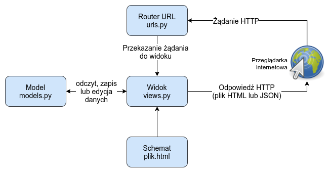

# Django

Warto zajrzeć tutaj: <https://docs.djangoproject.com/en/5.1/intro/tutorial01/>

https://bulldogjob.pl/readme/architektura-django

## Struktura projektu

Projekt w django tuż po stworzeniu (`django-admin startproject mysite`) wygląda mniej więcej tak:

```files
mysite/
    manage.py
    mysite/
        __init__.py
        settings.py
        urls.py
        asgi.py
        wsgi.py
```

mamy tu folder projektu w którym mamy poszczególne aplikacje. Na ten moment mamy tylko folder mysite zawierający ogólną konfigurację projektu,a w nim pliki takie jak:

- settings.py - konfiguracja projektu, jakie bazy danych mają byc używane, język projektu, moduły wykorzystywane w projekcie etc. [link](https://docs.djangoproject.com/en/5.1/topics/settings/)
- urls.py - deklaracje url opisujące co ma być dostepne pod jakimi ścieżkami [link](https://docs.djangoproject.com/en/5.1/topics/http/urls/)

Komendą `manage.py startapp polls` możemy dodać nową apkę o nazwie polls.

Struktura aplikcaji:

```files
polls/
    __init__.py
    admin.py
    apps.py
    migrations/
        __init__.py
    models.py
    tests.py
    views.py
```

Pliki:

- admin.py - to jak ma wyglądać panel administracyjny dla danej apki
- urls.py - analogiczny do pliku urls.py w folderze opisującym projekt
- models.py - modele, które będą znajdować się naszych bazach danych
- views.py - poszczególne widoki znajdujące się w naszej aplikacji, możemy tutaj wystawić poszczególne API RESTowe, lub stronki w HTMLu
- tests.py



Dodatkowe pliki mogące się tu znajdować:

- serializers.py - [link](https://docs.djangoproject.com/en/5.1/topics/serialization/) klasy wykorzystywane do serializacji modeli na inne formaty (np. json, lub xml)

Przy większych projektach warto rozsądne rozszerzenie powyższego schematu [przykład](https://github.com/Mischback/django-project-skeleton)

## Zarządzanie i praca z projektem

Do tego wykorzystywany jest skrypcik `manage.py` znajdujący się w głównym folderze projektu.

Może byc on wykorzystywany chociażby do tworzenia (lub aktualizacji) tablic w bazie danych odpowiadających strukturom danych opisanych w modelach.

```bash
manage.py makemigrations # przygotowuje instrukcje potrzebne do zaktualizowania struktur w bazie
manage.py migrate #wykonanie migracji
```

Do wygodnej "zabawy" z danymi oraz klasami w bazie można użyć `manage.py shell`.

## Modele danych

W django możemy w prosty sposób stworzyć własne struktury, które potem w automatyczny sposób będą mogły być mapowane na struktury znajdujące się w naszych klasycznych bazach danych. [dokumnetacja](https://docs.djangoproject.com/en/5.1/topics/db/models/)

Wszystkie modele bazują na klasie [django.db.models.Model](https://docs.djangoproject.com/en/5.1/ref/models/instances/#django.db.models.Model).

```python
from django.db import models

class Person(models.Model):
    first_name = models.CharField(max_length=30)
    last_name = models.CharField(max_length=30)
```

### Definiowanie

Nowe modele powstają poprzez stworzenie klasy dziedziczącej po bazowej klasie W klasie tej zdefiniowane przez nas pola są rekordami.  
Mamy tutaj typowe rodzaje pól takie jak:

- CharField
- IntegerField
- ForeignKey - klucz obcy [link](https://docs.djangoproject.com/en/5.1/ref/models/fields/#django.db.models.ForeignKey)
- ManyToManyField - relacja typu wiele do wielu, pozwala na bezpośrednie i [pośrednie](https://docs.djangoproject.com/en/5.1/topics/db/models/#extra-fields-on-many-to-many-relationships) łączenie z wieloma rekordami
- etc.

Dla każdego pola możemy określić też dodatkowe parametry takie jak nullowalność, maksymalną sługość (dla stringów), możliwe dozwolone wartości itp. Możemy też samodzielnie wybierać pole będące kluczem (chociaż na ogół te automatycznie dodawane wystarcza).

Na podstawie tych klas możemy potem wygenerować tabele w baszej bazie (lub zaktualizować obecne, aby dopasowac) wykonując migrację (z użyciek spryptu `manage.py`).

W każdej klasie możemy dodatkowo określić klasę `Meta` pozwalającą określić dodatkowe informacje o naszym modelu, takie jak wymagania co do unikalności pól, tworzenie indeksów ze złączenia dwóch pól etc, nazwę okiektu, lub stworzyć klasę abstrakcyjną. [pełna lista opcji](https://docs.djangoproject.com/en/5.1/ref/models/options/)

```python
from django.db import models

class Ox(models.Model):
    horn_length = models.IntegerField()

    class Meta:
        ordering = ["horn_length"]
        verbose_name_plural = "oxen"
```

#### Metody

Dodatkowo dla modelu mozęmy zdefiniować własne metody. Warto zaimplementować chociażby `__str__()`, która jest używana do wypisywania obiektóe w panelu administratora, podobnie jak `get_absolute_url()`. Przydatny może być też dekorator `@property`.

W niektórych wypadkach możemy też chcieć nadpisać domyślne metody takie jak `save()`, czy też `delete()`, gdy chcemy np zablokować usuwanie jakichś elementów.

```python
from django.db import models

class Blog(models.Model):
    name = models.CharField(max_length=100)
    tagline = models.TextField()

    def save(self, *args, **kwargs):
        if self.name == "Yoko Ono's blog":
            return # Yoko shall never have her own blog!
        else:
            super().save(*args, **kwargs)  # Call the "real" save() method.
```

### Praca z modelami

Każda klasa ma artybut `objects`, jest obiekt klasy [Manager](https://docs.djangoproject.com/en/5.1/topics/db/managers/#django.db.models.Manager). Służy on do wykonywania zapytań do bazy.

Przydatne [metody do wykonywania zapytań](https://docs.djangoproject.com/en/5.1/topics/db/queries/):

```python
People.objects.all()
People.objects.filter(name="Jan")
People.objects.exclude(surname="Kowalski)

# gdy chcemy uzyskać jeden wynik oraz wiemy, że taki wynik istnieje
# jeśli nie istnieje to dostaniemy wyjątek Entry.DoesNotExist
People.objects.get(pesel=12345678)

p1 = Poeple.objects.create(name="Marian",surname="Nowak") #stworzenie instancji i zapisanie modelu
p2 = People(name="Jan",surname="Kowalski")
p2.save() #zapisanie do bazy
```

Przykładowe metody:

- [create()](https://docs.djangoproject.com/en/5.1/ref/models/querysets/#django.db.models.query.QuerySet.create) - tworzy i natychmiast zapisuje obiekt w bazie danych
- [save()](https://docs.djangoproject.com/en/5.1/topics/db/queries/#creating-objects) ręczne zapisywanie do bazy danych. Często wykorzystywane, kiedy przy pierwszych prokach tworzenia używamy konstruktora

#### Filtrowanie

Sposoby filtrowania nie ogarniczają się do podawania wartości oczekiwanych. Możemy też używać różnych prefixów. [link](https://docs.djangoproject.com/en/5.1/topics/db/queries/)

```python
People.objects.filter(surname__startswith="Kowalski)
```

Filtry można też łatwo ze sobą łączyć zanim przejdziemy do wykonania zapytania wykorzystując klasę `Q`.

Do łączenia możemy wykorzystać operatory: `|=` (lub) oraz `&=` (i).

```python
from django.db.models import Q

q = Q()
if param_1 != 'all':
    q &= Q(param_1__name=param_1)
if param_2 != 'all':
    q &= Q(param_2__name=param_2)
class_var = ClassName.objects.filter(q)

#LUB

q = {}
if param_1 != 'all':
    q.update({'param_1__name': param_1})
if param_2 != 'all':
    q.update({'param_2__name': param_2})
class_var = ClassName.objects.filter(**q)
```

Przy odpowiednim wykorzystaniu kluczy obcych można także wykonywać proste filtry na łączeniach. [link](https://docs.djangoproject.com/en/5.1/topics/db/queries/#backwards-related-objects). Przydaje się tu argument `related_name`.

```python
class Sessions(models.Model):
    sessionId = models.AutoField(primary_key=True)

class Ip(models.Model):
    ipId = models.AutoField(primary_key=True)

class Affiliation(models.Model):
    affiliationId = models.AutoField(primary_key=True)
    ip = models.ForeignKey("Ip", null=False, db_column="ipId")
    session = models.ForeignKey(
        "Sessions",
        related_name="affiliation_session"
    )


#potem można wołać
Sessions.objects.filter(affiliation_session__ip_id=X)
```

TODO więcej przykładów by się przydało

## Widoki

[link - Writing your first Django app, part 3](https://docs.djangoproject.com/en/5.1/intro/tutorial03/)

[The Django template language](https://docs.djangoproject.com/en/4.0/ref/templates/language/)

Widok jest typem strony internetowej generowany przez django.  
Widoki mogą być zwykłymi stronkami w HTMLu, mogą to być też widoki na jakieś dane. W wielu wypadkach pozwalają na swoiste zautomatyzowanie danej strony

Widok może być klasą lub funkcją zwracającą JSON-a, lub stronę w HTMLu.

```python
class UserLogin(LoginView):
    template_name = 'sjopinie_app/login.html'
```

```python
from django.shortcuts import render

from .models import Question


def index(request):
    latest_question_list = Question.objects.order_by('-pub_date')[:5]
    #kontekst pozwala na późniejsze wykorzystywanie wartości w kodzie templatki
    context = {'latest_question_list': latest_question_list}
    return render(request, 'polls/index.html', context)
```

Przykładowy schemat strony dla powyższego przykładu

```html

<ul>
  
  <li><a href="/polls/{{ question.id }}/">{{ question.question_text }}</a></li>
  
</ul>

<p>No polls are available.</p>

```

Dzięki przekazaniu wartości w kontekście templatka może korzystać z podanych wartości.

## Panel Administratora

<https://docs.djangoproject.com/en/5.1/intro/tutorial02/#introducing-the-django-admin>

## REST API

Do pracy z API RESTowym zaleca się użycie specjalnego frameworka <https://www.django-rest-framework.org/tutorial/quickstart/>

### Serializacja

[link](https://www.django-rest-framework.org/api-guide/serializers/)

### Widoki dla RESTa

Używanie widoków pozwala łatwo zautomatyzować wyświetlanie danych. Za jednym zamachem możemy wystawić API reagujące na wszystkie typy zapytań (GET, PUT, POST, DELETE)

Można do tego wykorzystać na przykład własną klasę dziedziczącą po `viewsets.ModelViewSet`. Dzięki temu dostaniemy nie tulko :gołe" API, lecz także django wygeneruje interfejs sieciowy do korzystania z tego API, w razie zgdybyśmy otowrzyli go w przeglądarce.

```python
from rest_framework import viewsets

#prosty widok na listę przedmiotów posortowanych alfabetycznie
class SubjectViewSet(viewsets.ModelViewSet):
    queryset = Subject.objects.all().order_by('name')
    serializer_class = SubjectSerializer

# tu już nieco bardziej skomplikowany widok, reagujący na podawane parametry
# Przykładowa ścieżka: lecturers/?name=Marian
class LecturerViewSet(viewsets.ModelViewSet):
    serializer_class = LecturerSerializer

    def get_queryset(self):
        lecturer_name = self.request.query_params.get('name')
        queryset = Lecturer.objects.filter(name=lecturer_name)
        return queryset
```

## Testy

Django może być testowane automatycznie z wykorzystaniem różnych frameworków do testowania, jednak domyślnym jest unittest. [link](https://docs.djangoproject.com/en/5.0/topics/testing/)

Domyślną klasą do testowania jest [django.test.TestCase](https://docs.djangoproject.com/en/5.0/topics/testing/tools/#django.test.TestCase), które jest subklasą [unittest.TestCase](https://docs.python.org/3/library/unittest.html#unittest.TestCase).


```py
from django.test import TestCase
from myapp.models import Animal


class AnimalTestCase(TestCase):
    def setUp(self):
        Animal.objects.create(name="lion", sound="roar")
        Animal.objects.create(name="cat", sound="meow")

    def test_animals_can_speak(self):
        """Animals that can speak are correctly identified"""
        lion = Animal.objects.get(name="lion")
        cat = Animal.objects.get(name="cat")
        self.assertEqual(lion.speak(), 'The lion says "roar"')
        self.assertEqual(cat.speak(), 'The cat says "meow"')

```

Testy uruchamiane są za pomocą `manage.py test`.

Na potrzeby testów tworzona jest tymczasowa [testowa baza danych](https://docs.djangoproject.com/en/5.0/topics/testing/overview/#the-test-database), która jest kasowana po zakończeniu testów. Możliwe jest jednak zachowanie bazy danych po testach. `test --keepdb`.

## Inne

### Praca z użytkownikami

Django pozwala włatwy sposób dodać uzytkowników do naszej aplikacji. [link](https://docs.djangoproject.com/en/5.1/topics/auth/default/)

Możemy tutaj uzyć gotowego modelu `django.contrib.auth.models.User`. Jeśli ten obiekt nam nie pasuje, zawsze możemy go [przystosować do swoich potrzeb](https://docs.djangoproject.com/en/5.1/topics/auth/customizing/#custom-users-and-the-built-in-auth-forms).

Do zalogowania uzytkownika z pomocą włanego formularza możemy wykorzystać metodę authenticate.

```python
from django.contrib.auth import authenticate
user = authenticate(username='john', password='secret')
if user is not None:
    # A backend authenticated the credentials
else:
    # No backend authenticated the credentials
```

Potem będziemy mogli sprawdzać przychodzące żądania pod kątem tego, czy pochodzą od jakiegoś użytkownika.

```python
if request.user.is_authenticated:
    # Do something for authenticated users.
    ...
else:
    # Do something for anonymous users.
    ...
```

Dla prostego zastrzegania treści tylko dla użytkowników możemy używać dekoratorów.

```python
# dla funkcji
from django.contrib.auth.decorators import login_required

@login_required
def my_view(request):
    ...


#dla klas widoków
from django.contrib.auth.mixins import LoginRequiredMixin

class MyView(LoginRequiredMixin, View):
    login_url = '/login/'
    redirect_field_name = 'redirect_to'

# dla innych wypadków np w serializerze
self.context['request'].user
```

Możemy także wprowadzać zmiany bezpośrednio na poziomie szablonów.

```html

<h1>Witaj {{user.get_username}}</h1>

<h1>Witaj nieznajomy</h1>

```

Używając tych mechanizmów możemy także tworzyć grupy użytkowników z różnymi uprawnieniami.

### Formularze

Formularze są jednym z najpopularniejszych sposobów na zbieranie danych od użytkowników. Django jest wyposażone w kilka mechanizmów wspomagających pracę z nimi. ([omówienie formularzy w django](https://docs.djangoproject.com/en/5.1/topics/forms/), [dokumentacja mozilli](https://developer.mozilla.org/en-US/docs/Web/HTML/Element/form))

Formularze możemy tworzyć ręcznie umieszczasjąc je bezpośrednio w schemacie strony

```html
<form action="/your-name/" method="post">
  <label for="your_name">Your name: </label>
  <input
    id="your_name"
    type="text"
    name="your_name"
    value="{{ current_name }}"
  />
  <input type="submit" value="OK" />
</form>
```

Możemy też do tego wykorzystać klasę [Form](https://docs.djangoproject.com/en/5.1/ref/forms/api/#django.forms.Form), która sama wygeneruje nam formularz.

```python
from django import forms

class NameForm(forms.Form):
    your_name = forms.CharField(label='Your name', max_length=100)
```

Następnie łączymy ten formularz z widokiem, który go obsługuje.(W przykładzie poniżej żądanie jest obsługiwane przez ten sam widok, który udostępnia formularz)

```python
from django.http import HttpResponseRedirect
from django.shortcuts import render

from .forms import NameForm

def get_name(request):
    # if this is a POST request we need to process the form data
    if request.method == 'POST':
        # create a form instance and populate it with data from the request:
        form = NameForm(request.POST)
        # check whether it's valid:
        if form.is_valid():
            # process the data in form.cleaned_data as required
            # ...
            # redirect to a new URL:
            return HttpResponseRedirect('/thanks/')

    # if a GET (or any other method) we'll create a blank form
    else:
        form = NameForm()

    return render(request, 'name.html', {'form': form})
```

Wykorzystany schemat `name.html`:

```html
<form action="/your-name/" method="post">
   {{ form }}
  <input type="submit" value="Submit" />
</form>
```

`csrf_token` jest sposobem na użycie ochrony przeciwko [CSRF](https://pl.wikipedia.org/wiki/Cross-site_request_forgery)
